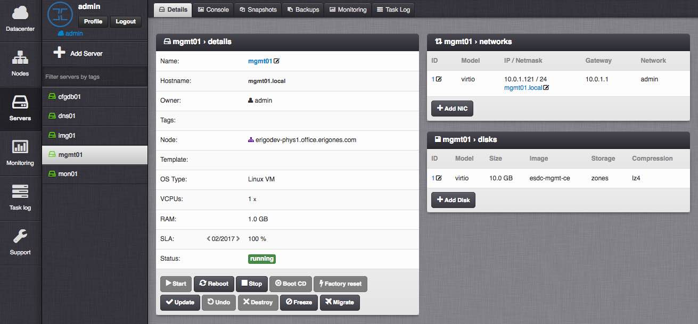
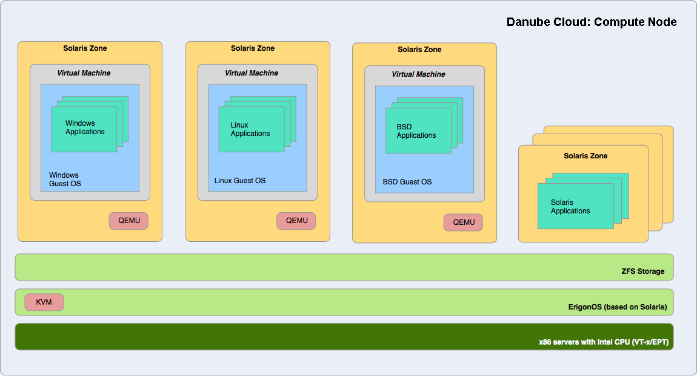
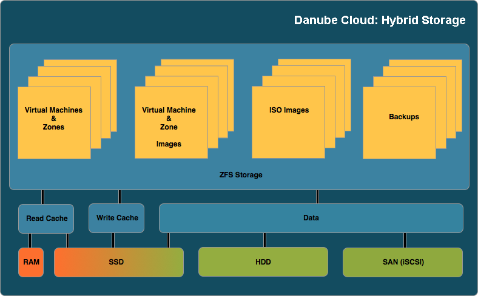
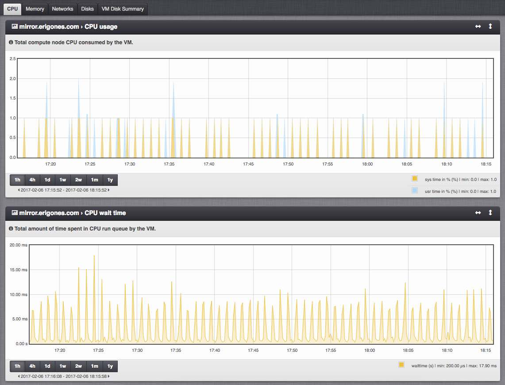

Danube Cloud Features
#####################

- `Cloud Management`_
    - `Centralized Web Management Portal`_
    - `Highly Available Central Management with Automatic Failover`_
    - `Bulk VM Import and Export`_
    - `API Interface`_
    - `Fast and Simple Deployment`_
    - `Integrated Management Tools`_
- `Virtualization`_
    - `Hardware Virtualization`_
    - `Container Virtualization`_
- `Network`_
- `Storage`_
    - `Technology`_
    - `Backups`_
    - `Replication`_
    - `VM Images and Image Repositories`_
- `Cloud and Data Security`_
- `Automatic Monitoring and Alerting`_
- `Extensive Documentation`_
- `Support`_

Cloud Management
================

Centralized Web Management Portal
---------------------------------
- Mobile-friendly, responsive HTML5 web interface that manages *Danube Cloud* data centers.
- Provides a complete overview of used physical and virtual resources.
- User and group access management.
- Virtual machine console (including windows GUI) is available through a HTML5 web browser.
- History of executed tasks is clearly displayed in the task log.

Highly Available Central Management with Automatic Failover
-----------------------------------------------------------
In case of a disaster or a hardware failure, the management automatically moves itself to other healthy node. Automatic WAN failover is supported, so even an outage of a whole data center does not prevent users from managing the rest of the cloud infrastructure.

Bulk VM Import and Export
-------------------------
The web interface can be used for import and export of data center objects (virtual servers). You can simply upload the spreadsheet file (e.g. xls) via the GUI and virtual machines will be created automatically according to the definition. Spreadsheets are used as templates for creating virtual machines and data centers. This allows users to work on an infrastructure before the actual deployment. They significantly reduce the amount of time spent during on-site deployment. They also simplify compute node resource sizing and software installation processes.

API Interface
-------------
*Danube Cloud* API can be used for automation of data center workflows and/or integration with existing external systems, e.g. ERPs and e-shops. Using the API, you can automate remote deployment tasks and create virtual machines or data centers quickly and exactly according to your needs. The API is extensively documented in the API reference guide. A command line tool for accessing the API is available and can be quickly reused in custom shell scripts.

Fast and Simple Deployment
--------------------------
Instead of booting from disks, the server can boot up directly from:

- USB drives
- memory cards
- network (ideal for mass deployment scenarios where USB does not scale)

A newly mounted physical server is automatically discovered and added to the management portal upon its first boot.

Multi-tenant Virtual Data Centers
---------------------------------
*Danube Cloud* supports a concept of virtual data centers with delegated administration, which allows reselling of virtual machines or whole virtual data centers to multiple customers. Alternatively, it may be used to separate different environments in one company. Virtual data centers allow securely and transparently divide data center resources among customers, groups and projects. *Danube Cloud* provides enough separation to allow multiple data centers to run on the same physical hosts. It allows efficient usage of resources by sharing services among customers.

Integrated Management Tools
---------------------------
A data center is not only centered around virtualization, but also needs a lot of software for network management, rack organization, IP address management (IPAM), DNS server(s), inventory management, user management. In some cases, these systems have to be redundantly configured. *Danube Cloud* comes integrated with these tools and can help data center operators and system administrators with multiple cloud management tasks. For example, creating a virtual machine will automatically update the IP address management system, create DNS records for the machine, configure the monitoring and so on.

Virtualization
==============

Hardware Virtualization
-----------------------
Virtualization of all major x86 guest operating systems are supported: UNIX/Linux, Windows, BSD and Solaris. KVM virtualization (including support for VirtIO acceleration) powered by enterprise grade operating system (SmartOS) provides a stable solution for wide range of customers.

Container Virtualization
------------------------
Applications can be run in separate containers without the need of virtualizing the whole operating system. Container virtualization has almost zero overhead compared to bare-metal and brings the best of both technologies - OS virtualization and bare-metal speed.

The concept of container virtualization is more than two decades old, but was not widespread that much until recently. Containers are best used with microservice style applications. By running a single and relatively small application in a container, the overall usage of computing resources is much lower compared to classical virtualization where running a dedicated OS can consume more resources than the application itself. Danube Cloud allows users to run containers and HW virtualization on the same host as virtual machines, which rapidly reduces the complexity of IT infrastructure.

Network
=======
- **Fully virtualized networking.** Each customer can have his own networks in his virtual data center, independent and separated from other customers.
- **Automatic network IP plan for virtual machines.** You only define a network subnet and *Danube Cloud* takes care of everything else.
- **Automatic VM network configuration.** IP addresses are automatically assigned and configured to VM during creation. It is OS independent and fully customizable if necessary.
- **Auto DNS management.** Forward and reverse DNS records are automatically created for every new virtual machine. These records are instantly available for use.
- **Automatic IP spoofing** prevention that will allow to pass only IP addresses that are assigned to a virtual machine. The network anti-spoofing also protects the VM from unusual IP traffic.

Storage
=======

Technology
----------
*Danube Cloud* integrates ZFS, the next generation enterprise file system and volume manager, and provides support for advanced ZFS performance features (advanced snapshots, clones, LZ4 compression, read/write optimization - L2ARC and ZIL).

*Danube Cloud* does not rely on any external storage, thus it helps to prevent creating a single point of failure. Each virtual machine resides on compute node's local storage with optional replication to a backup compute node. For I/O-intensive applications, external storage can be attached via iSCSI or Fibre Channel. At the moment, QLogic (4Gbps, 8Gbps and 10Gbps CNA) and Emulex FC HBAs (8Gbps and 16Gbps) are supported.

Backups
-------
The same snapshot technology is leveraged for creating consistent enterprise ready off-site backups, which can be used to quickly restore virtual machines anywhere in your infrastructure when major disaster situation occurs. By using incremental-forever type of backups, you need to do a full backup of any virtual machine only once per its lifetime. Subsequent VM backups are incremental, which tremendously decreases the amount of data transferred over network. Your disaster recovery setup has never been easier.

Furthermore, virtual machine backups and snapshots support a filesystem freeze (to ensure filesystem consistency) and running a custom script using an OS agent inside the virtual machine (to ensure application consistency). Windows Volume Shadow Copy (VSS) is also supported.

Replication
-----------
Replication is used to automatically create copies of virtual machines in near real-time. The copies are transferred to different compute nodes and can be started in case of an emergency. This is an advantage for applications, which cannot be clustered. This feature is almost exclusive to storage systems and *Danube Cloud* has it available in a single package with virtualization capabilities.

VM Images and Image Repositories
--------------------------------
*Danube Cloud* comes with an integrated image server that is used to distribute virtual machine images to all nodes. Images can be simply created also from virtual machines. This allows cloud administrators to quickly create and share copies of existing virtual servers and application configurations. With *Danube Cloud*, system administrators can easily access preconfigured images from various (internal or external) image repositories, and thus speed up installation of servers and services.

Cloud and Data Security
=======================
Virtual machines are isolated on several levels:

- *hypervisor level* - virtual machines run inside containers what provides additional separation of customer data compared to other virtualization solutions;
- *network level* - each virtual data center has its own distributed private networking separated from other networks; in public networks, anti-spoofing protection forbids virtual machines to communicate using IP/MAC addresses that don't belong to them;
- *filesystem level* - data are carefully managed and protected by the next generation enterprise file system and volume manager - ZFS;
- *data center level* - all data centers may have their own dedicated CPU, storage and memory resources; alternatively they may share resources with limits in a secure way.

Automatic Monitoring and Alerting
=================================
Integrated Zabbix server is used for monitoring of:

- physical hardware;
- compute node software;
- agent-less monitoring of virtual machines and containers;
- agent-based customizable monitoring of virtual machines and containers.

Configuration of advanced monitoring solutions is labour-intensive task and usually comes with initial configuration difficulties. These problems are largely eliminated by the monitoring system integrated into *Danube Cloud*. The monitoring solution bundled with *Danube Cloud* is automatically configured from the beginning, yet it allows to create complex monitoring templates.

Thanks to well defined triggers, you are able to receive early warnings about issues in your system. Notifications may help you to prevent periods of unplanned downtime. Notifications can be sent using multiple channels (e.g. by email or SMS).

Using our bundled and tailored Zabbix-based monitoring software, you can easily integrate *Danube Cloud* monitoring with your monitoring platform. This can be done either using a Zabbix Proxy or a custom Zabbix server per virtual data center.

**Ludolph**
    Email, SMS and XMPP alerting is available through our alerting solution called `Ludolph <https://github.com/erigones/Ludolph>`__. Additionally, it may be utilized to communicate with the monitoring system; giving the user a quick overview of data center status, setting planned maintenance periods and much more. More alerting options (mobile push notifications) and integration scenarios with external services are possible, and are thoroughly explained in the *Danube Cloud* user guide.

Extensive Documentation
=======================
The documentation consists of a `user guide <https://docs.danube.cloud>`__ and `API documentation <https://docs.danube.cloud/api-reference/>`__. The user guide also contains several `HOW-TOs <https://docs.danube.cloud/user-guide/howto/index.html>`__ for best practice service configuration.

Support
=======
Implementation partners provide 1st and 2nd level of support. *Danube Cloud* or its authorized service centers deal with 3rd level of support via implementation partners. Authorized persons can ask for support directly via our support portal or by phone or email. The support is available 24/7. It is also possible to provide proactive support through remote access based on SLA. *Danube Cloud* also provides technical training and certifications for *Danube Cloud*.
