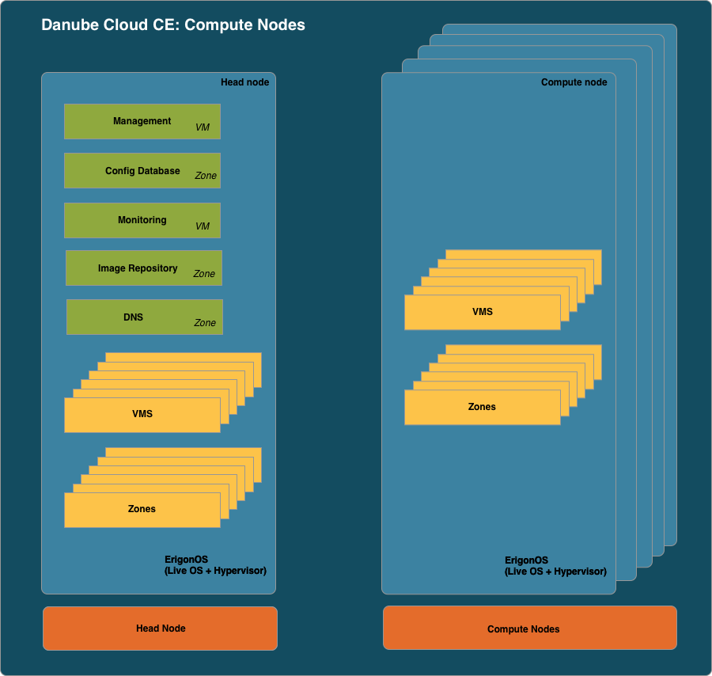

============
Danube Cloud
============

**Danube Cloud is a cloud management software used for deploying, maintaining and automating cloud data centers and their processes.**

Links
=====

- Danube Cloud Enterprise Edition and general information: https://danubecloud.com

- Danube Cloud Community Edition homepage: https://danubecloud.org

- Danube Cloud User Guide (for both Enterprise Edition and Community Edition): https://docs.danubecloud.org

- Danube Cloud Development and Contributing: https://developer.danubecloud.org

    .. note:: If you have found a bug, please don't hesitate and report it in the main bug tracker: https://github.com/erigones/esdc-ce/issues.

Architecture Overview
=====================

Danube Cloud Enterprise Edition
-------------------------------

.. image:: img/esdc-ee-architecture.png
    :align: center
    :alt: Danube Cloud Enterprise Edition: Compute Nodes

Danube Cloud Community Edition
------------------------------

