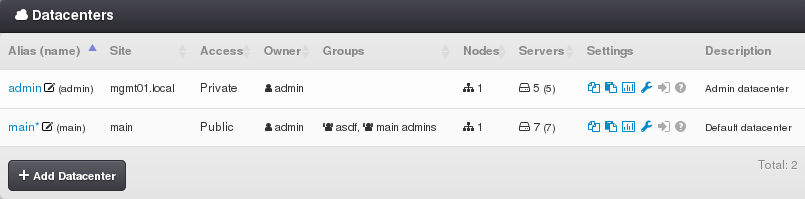
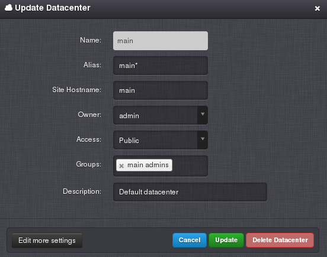

.. _dcs:

Virtual Data Center
###################

A Virtual Data Center is a logical set of hardware computing resources that can be dedicated to a virtual data center (Reserved strategy), shared with other data centers (Shared strategy), or shared with other data centers with restrictions (Shared with limit).

=============================== ================
:ref:`Access Permissions <acl>`
------------------------------- ----------------
*SuperAdmin*                    read-write 
*DCAdmin*                       read-only
=============================== ================

.. warning:: The :ref:`admin virtual data center <admin_dc>` is designed to run virtual servers, which are required for the operation of *Danube Cloud* software and it is not recommended to use this virtual data center for other purposes. Any manipulation with compute nodes, virtual servers or other objects in the *admin* virtual data center is not recommended and should be consulted with your *Danube Cloud* support provider.

.. note:: The *main* virtual data center is the default data center that is available immediately after successful installation of *Danube Cloud*. The *main* data center is always public and it cannot be deleted.

.. seealso:: More information about accessing virtual data centers by users can be found in a :ref:`separate chapter about access control lists <acl>`.

Virtual Data Center Parameters
==============================

* **Name** - Unique identifier of a data center (usually  used in the :ref:`API <api>`).
* **Alias** - User-defined name of a data center (usually displayed in the :ref:`GUI <gui>`).
* **Site** - Hostname part of the browsing URL that determines the current working data center for an anonymous user (non-logged in user). You will need a working DNS record with the same hostname pointing to your Danube Cloud management portal.
* **Access** - Data center visibility. One of:

    * *Public* - Data center is accessible by any active user.
    * *Private* - Data center is accessible by *SuperAdmins*, *DC owners* or users within groups associated with this data center.
* **Owner** - User who owns the data center is the also called the main data center administrator - *DCAdmin*.
* **Groups** - :ref:`User groups <groups>` that have access to a data center.
* **Description**
* **Nodes** - Number of compute nodes attached to a data center (read-only).
* **Servers** - Number of virtual servers defined in a data center (read-only).
* **Settings** - Access to all data center settings. The Settings column in the data center list shows currently enabled data center modules.

    .. image:: img/dc_features.png

    .. seealso:: The :ref:`advanced virtual data center settings <dc_settings>` allow for more detailed configuration of all data center options and limits, including enabling and disabling individual DC modules.

Managing a Virtual Data Center
==============================

A virtual data center can be created, updated and deleted only by a *SuperAdmin*. A virtual data center can be deleted only if it is empty, which means that it has no :ref:`compute nodes <nodes>`, :ref:`virtual servers <vms>` or :ref:`server backups <vm_backups>` associated with it.

