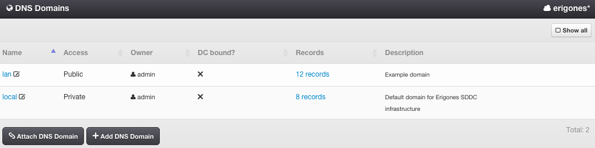
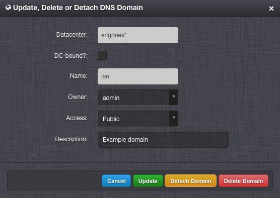
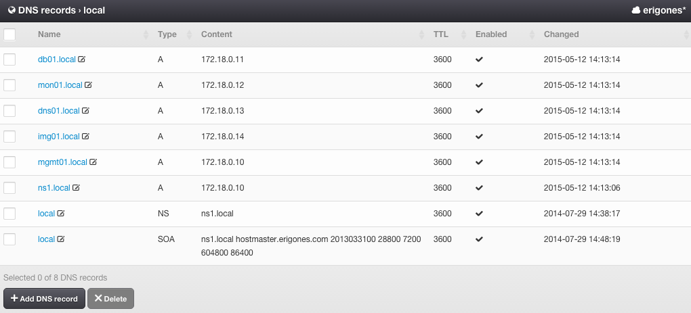

.. _dc_dns:
.. _dns:

DNS
###

The DNS feature included in *Danube Cloud* enables a simple management of DNS domains and records.

=============================== ================
:ref:`Access Permissions <acl>`
------------------------------- ----------------
*SuperAdmin*                    read-write
*DCAdmin*                       read-only
*DnsAdmin*                      read-write on DNS records (DC-bound domains only)
=============================== ================

.. note:: In the upper right corner is a button labeled ``Show All``, which can be used to display all domains, including domains that are not associated with the current working virtual data center.

DNS Domain Parameters
=====================

* **Name** - DNS domain name.
* **Access** - DNS domain visibility. One of:

    * *Public* - DNS domain is usable by all users in this virtual data center.
    * *Private* - DNS domain is usable by *SuperAdmins*, *DCAdmins*, and owners of this domain.
* **Type** - PowerDNS domain type which determines how records are replicated. One of:

    * *MASTER* - PowerDNS will use DNS protocol messages to communicate changes with slaves.
    * *NATIVE* - PowerDNS will use database replication between master DNS server and slave DNS servers.
* **Owner** - DNS domain owner.
* **DC-bound?** - Whether a DNS domain is bound to a specific virtual data center.
* **Records** - Number of DNS records within a DNS domain and a link to DNS record management (read-only).
* **Description**

Managing a DNS Domain
=====================

A DNS domain can be created, updated and deleted only by a *SuperAdmin*.

.. note:: The default DNS domain (:ref:`VMS_VM_DOMAIN_DEFAULT <dc_dns_settings>`) cannot be deleted.

Attaching a DNS Domain
======================

Used for associating an existing domain with a virtual data center. Can be performed only by a *SuperAdmin*.

.. note:: A DNS domain can be only used when attached to a virtual data center.

Detaching a DNS Domain
======================

Used for removing an association of a domain with a virtual data center. Can be performed only by a *SuperAdmin*.

DNS Records
===========

DNS Record Parameters
=====================

* **Name** - The name of the DNS record - the full URI the DNS server should pick up on.
* **Type** - DNS record type. One of: *A*, *AAAA*, *CERT*, *CNAME*, *HINFO*, *KEY*, *LOC*, *MX*, *NAPTR*, *NS*, *PTR*, *RP*, *SOA*, *SPF*, *SSHFP*, *SRV*, *TLSA*, *TXT*.
* **Content** - DNS record content - the answer to the DNS query.
* **TTL** - How long (seconds) the DNS client is allowed to remember this record.
* **Enabled** - If set to false, this record is hidden from DNS clients.
* **Changed** - The date and time when the record was last changed (read-only).

Managing DNS Records
====================

Custom DNS records can be created, updated or removed by a *SuperAdmin* or by a *DnsAdmin* (DC-bound domain only).

