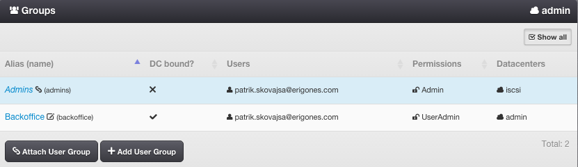
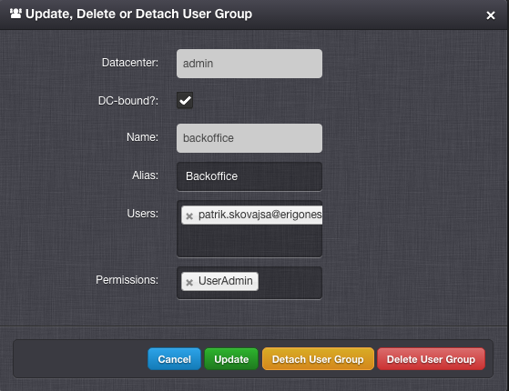

.. _dc_groups:
.. _groups:

Groups
######

A User Group represents a set of users with similar roles. A user group essentially creates an association between users and permissions.

=============================== ================
:ref:`Access Permissions <acl>`
------------------------------- ----------------
*SuperAdmin*                    read-write
*DCAdmin*                       read-only
*UserAdmin*                     read-only (DC-bound groups only)
=============================== ================

.. note:: In the upper right corner is a button labeled ``Show All``, which can be used to display all groups, including groups that are not associated with the current working virtual data center.

.. seealso:: More information about user :ref:`roles and permissions <acl>`.

User Group Parameters
=====================

* **Name** - Unique group identifier (usually used in the :ref:`API <api>`).
* **Alias** - User-defined name of a group (usually displayed in the :ref:`GUI <gui>`).
* **DC-bound?** - Whether a user group is bound to a specific virtual data center.
* **Users** - List of :ref:`users <users>` assigned to a group.
* **Permissions** - List of :ref:`permissions <permissions>` assigned to a group. One of:

    * *Admin*
    * *NetworkAdmin*
    * *ImageAdmin*
    * *ImageImportAdmin*
    * *TemplateAdmin*
    * *IsoAdmin*
    * *DnsAdmin*
    * *UserAdmin*

Managing a User Group
=====================

A user group can be created, updated, deleted by a *SuperAdmin*.

.. note:: A *SuperAdmin* can create an unlimited number of groups; each group may include any number of users and permissions.

Attaching a User Group
======================

Used for associating an existing group with a virtual data center, giving all group members access to the virtual data center. This operation can be performed only by a *SuperAdmin*.

Detaching a User Group
======================

Used for removing an association of a group with a virtual data center, disabling access to the virtual data center for all group members. This can be performed only by a *SuperAdmin*.

.. seealso:: Group association with a virtual data center can be also managed via the :ref:`virtual data center settings page <dcs>`.

    .. image:: img/add_group_to_dc.png

