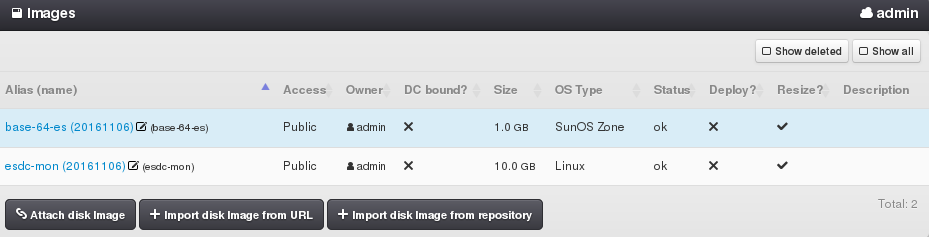
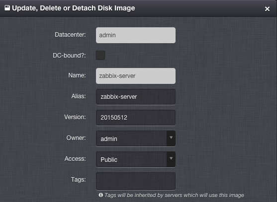
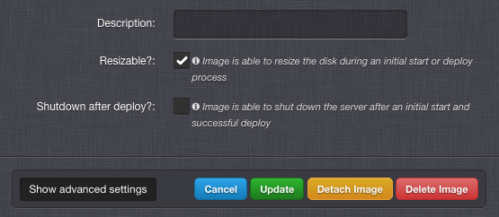

.. _dc_image:
.. _images:

Images
######

A disk Image is a template used to create virtual disks and quickly bootstrap ready-to-use virtual servers. A disk image usually contains a pre-installed operating system and a set of post-installation scripts, which are responsible for an automated configuration of the operating system, services and applications.

================================= ================
:ref:`Access Permissions <acl>`
--------------------------------- ----------------
*SuperAdmin*                      read-write
*DCAdmin*                         read-only
*ImageAdmin*                      read-write (DC-bound images only, limited by :ref:`DC image settings <dc_image_settings>`)
*ImageAdmin* + *ImageImportAdmin* read-write + import images from remote source
================================= ================

.. note:: In the upper right corner is a button labeled ``Show All``, which can be used to display all images, including images that are not associated with the current working virtual data center.

.. seealso:: When creating virtual servers from disk images, it is possible and often required to :ref:`assign parameters (metadata) to virtual servers <metadata>`, which can be used by a virtual server for its configuration during server's initial start or other purposes.

Image Parameters
================

* **Name** - Unique image identifier (usually used in the :ref:`API <api>`).
* **Alias** - User-defined name of an image (usually displayed in the :ref:`GUI <gui>`).
* **Version** - Image version.
* **Access** - Image visibility. One of:

    * *Public* - Image is usable by all users in this virtual data center.
    * *Private* - Image is usable by *SuperAdmins* and owners of this image.
    * *Deleted* - Image is hidden and unusable for new servers, but can be still used by some already defined servers.
* **Owner** - Image owner.
* **DC-bound?** - Whether a disk image is bound to a specific virtual data center.
* **Size** - Minimal virtual disk size required by a disk image (read-only).
* **OS Type** - Operating system type (read-only). One of:

    * *Linux VM*
    * *Windows VM*
    * *BSD VM*
    * *SunOS VM*
    * *SunOS Zone*
* **Status** - Current state of a disk image (read-only). One of:

    * *ok* - Image is ready to use.
    * *pending* - Image is being created, updated or deleted.
* **Resizable? (Resize)** - Specifies whether an image is able to resize a virtual disk during an initial start or deploy procedure. This is usually achieved by a post-installation script that has to be included in the disk image.
* **Shutdown after deploy? (Deploy)** - Specifies whether an image is able to shut down a virtual server after an initial start. Such an image should include a post-installation script, which will shut down the running operating system after it has been successfully configured. After a virtual server is stopped, it is considered to be successfully deployed, and it will be automatically started by the system.
* **Description**

Managing an Image
=================

A disk image can be created, updated or deleted by a *SuperAdmin* or by a *ImageAdmin* (DC-bound image only). A disk image can be created from a snapshot of a virtual server or can be imported from a remote location. The import operation can be performed only by a *SuperAdmin* or a *DCAdmin* user with *ImageAdmin* **and** *ImageImportAdmin* permissions. An image used by at least one virtual machine cannot be deleted. However, its *Access* attribute can be changed to *Deleted*, thus the image will be hidden and unusable for new virtual servers.

.. note:: Management of server images is related to the :ref:`VMS_IMAGE_VM <dc_image_settings>` global setting. With no image server configured all operations will be performed at database level only.

.. seealso:: Creating an image from a server snapshot is thoroughly explained in a :ref:`separate chapter <image_create>` dedicated to virtual server :ref:`snapshots <snapshot>`.

Advanced Image Settings
-----------------------

* **Tags** - Comma-separated list of image tags, which will be inherited by virtual servers that will use this image.

Attaching an Image
==================

Used for associating an existing disk image with a virtual data center. This operation can be performed only by a *SuperAdmin*.

.. note:: A disk image can be only used when attached to a virtual data center.

Detaching an Image
==================

In order to remove an association of a disk image with a virtual data center, the image must not be used by any virtual machine within the virtual data center. This can be performed only by a *SuperAdmin*.

Importing and Image
===================

A disk image can be imported from a remote location. The import operation can be performed only by a *SuperAdmin* or a *DCAdmin* user with *ImageAdmin* **and** *ImageImportAdmin* permissions. An image manifest URL (with `IMGAPI <https://images.joyent.com/docs/>`__ metadata about the image) is required for the import operation.

.. _imagestores:

Image Repositories
------------------

A disk Image Repository (a.k.a. ImageStore) is a remote server location with :ref:`disk images <images>` available for download. It has to implement the `IMGAPI <https://images.joyent.com/docs/>`__ endpoints for listing and downloading image manifests and files. Disk image repositories can be configured by modifying the :ref:`VMS_IMAGE_REPOSITORIES <dc_image_settings>` global setting. After the image repository is properly configured and loaded, one can browse through all available images and import them onto the internal image server.

.. note:: If a global image server (:ref:`VMS_IMAGE_VM <dc_image_settings>`) is configured in the system, the image repository list will automatically include a local repository named after the image server. This functionality can be used to import manually created images (i.e. images converted from other virtualization platforms), which were placed onto the image server by hand.
