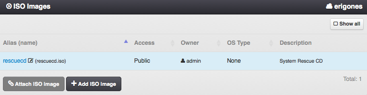
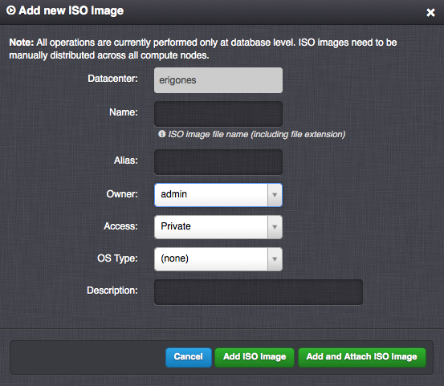

.. _dc_iso:
.. _iso_images:

ISO Images
##########

An ISO Image is usually used to manually install an operating system and application onto a new virtual server. It is often used to create new :ref:`disk images <images>`.

=============================== ================
:ref:`Access Permissions <acl>`
------------------------------- ----------------
*SuperAdmin*                    read-write
*DCAdmin*                       read-only
*IsoAdmin*                      read-write (DC-bound ISO images only, limited by :ref:`DC ISO image settings <dc_iso_image_settings>`)
=============================== ================

.. note:: In the upper right corner is a button labeled ``Show All``, which can be used to display all ISO images, including ISO images that are not associated with the current working virtual data center.

ISO Image Parameters
====================

* **Name** - Unique ISO image identifier (usually used in the :ref:`API <api>`).
* **Alias** - User-defined name of an ISO image (usually displayed in the :ref:`GUI <gui>`).
* **Access** - ISO image visibility. One of:

    * *Public* - ISO image is usable by all users in this virtual data center.
    * *Private* - ISO image is usable by *SuperAdmins* and owners of this image.
* **Owner** - ISO image owner.
* **DC-bound?** - Whether an ISO image is bound to a specific virtual data center.
* **OS Type** - Operating system type. One of:

    * *(none)* - ISO image can be used by any KVM virtual server.
    * *Linux VM*
    * *Windows VM*
    * *BSD VM*
    * *SunOS VM*
* **Description**

.. _managing_iso_image:

Managing an ISO Image
=====================

An ISO image can be created, updated or deleted by a *SuperAdmin* or by an *IsoAdmin* (DC-bound ISO image only).

.. note:: All ISO image operations are currently performed only at the database level. ISO images need to be manually distributed across all compute nodes.

.. note:: The default Rescue ISO image cannot be deleted.

Adding an ISO Image
-------------------

* ISO image files (``*.iso``) need to be copied to the ``/iso`` folder on each compute node:

    .. code-block:: bash

        user@laptop:~ $ scp ubuntu-14.04.1-server-amd64.iso root@node01:/iso/

* Alternatively, they can be download directly to the ``/iso`` folder on each compute node:

    .. code-block:: bash

        [root@node01 ~] cd /iso
        [root@node01 /iso] wget http://url/ubuntu-14.04.1-server-amd64.iso

.. seealso:: Installation of some operating systems (Windows) may require the use of :ref:`two virtual CD-ROM drivers <cdimage2>`.

Attaching an ISO Image
======================

Used for associating an existing ISO image with a virtual data center. This operation can be performed only by a *SuperAdmin*.

.. note:: An ISO image can be only used when attached to a virtual data center.

Detaching an ISO Image
======================

In order to remove an association of an ISO image with a virtual data center, the ISO image should not be used by any virtual machine within the virtual data center. This can be performed only by a *SuperAdmin*.

