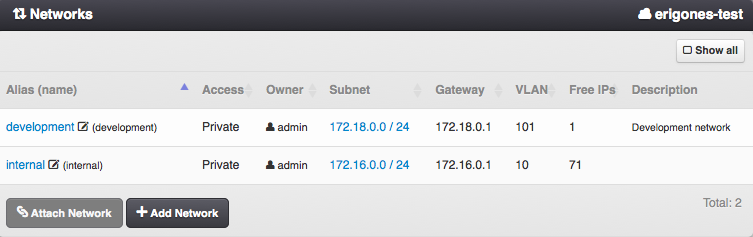
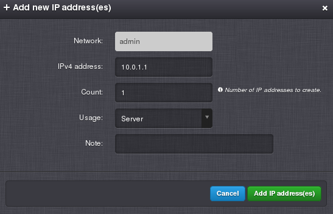

.. _dc_network:
.. _networks:

Networks
########

A virtual Network is essentially an IPv4 subnet used for physical and logical segmentation of network traffic between virtual servers.

=============================== ================
:ref:`Access Permissions <acl>`
------------------------------- ----------------
*SuperAdmin*                    read-write
*DCAdmin*                       read-only
*NetworkAdmin*                  read-write (DC-bound networks only, limited by :ref:`DC network settings <dc_network_settings>`)
=============================== ================

.. note:: In the upper right corner is a button labeled ``Show All``, which can be used to display all networks, including networks that are not associated with the current working virtual data center.

.. seealso:: More information about virtual networks and their connection to the physical network can be found in a :ref:`separate chapter about networking <network_virtual>`.

Network Parameters
==================

* **Name** - Unique network identifier (usually used in the :ref:`API <api>`).
* **Alias** - User-defined name of a network (usually displayed in the :ref:`GUI <gui>`).
* **Access** - Network visibility. One of:

    * *Public* - Network is usable by all users in this virtual data center.
    * *Private* - Network is usable by *SuperAdmins* and owners of this network.
    * *Deleted* - Network is hidden and unusable for new servers, but can be still used by some already defined servers.
* **Owner** - Network owner.
* **DC-bound?** - Whether a network is bound to a specific virtual data center.
* **Subnet** - IPv4 network prefix and subnet mask.
* **Gateway** - IPv4 gateway.
* **VLAN** - 802.1Q virtual LAN ID (0 = none).
* **NIC Tag** - :ref:`NIC tag <network_nictag>` configured on a compute node.
* **VXLAN** - VXLAN ID required for overlay NIC tags (1 - 16777215).
* **MTU** - MTU for the network vNIC (576 - 9000)
* **Free IPs** - The current amount of usable free IP addresses (read-only).
* **Description**

Managing a Network
==================

A network can be created, updated and deleted by a *SuperAdmin* or by a *NetworkAdmin* (DC-bound network only). A network used by at least one virtual machine cannot be deleted. However, its *Access* attribute can be changed to *Deleted*, thus the network will be hidden and unusable for new virtual servers.

    .. image:: img/add_network.png

.. note:: A virtual network is connected to the physical network interfaces on compute nodes via NIC tags. :ref:`NIC tags must be configured on every compute node in advance <network>`.

Advanced Network Settings
-------------------------

    .. image:: img/add_network_details.png

* **Resolvers** - Comma-separated list of IPv4 addresses that can be used as DNS resolvers by virtual servers using this network.
* **PTR domain** - Existing in-addr.arpa domain name used for creating PTR associations with virtual servers.
* **DHCP passthrough** - When true, IP addresses for this network are managed by an external DHCP service.

    .. warning:: It is still possible to add IP addresses via *Danube Cloud* to this network. However, IP address conflicts may occur while doing so.

Network Details
---------------

    .. image:: img/network_more_details.png

Attaching a Network
===================

Used for associating an existing network with a virtual data center. Can be performed only by a *SuperAdmin*.

.. note:: A virtual network can be only used when attached to a virtual data center.

Detaching a Network
===================

In order to remove an association of a network with a virtual data center, the network must not be used by any virtual machine within the virtual data center. Can be performed only by a *SuperAdmin*.

Network IP Addresses
====================

    .. image:: img/ip_list.png

IP Address Parameters
=====================

* **IP address**
* **Usage** - Usage type. One of:

    * *Server* - IP address can be assigned to a virtual server,
    * *Other* - IP address is reserved for other purposes in this network (e.g. HW router, IP printer, etc.).
* **Server** - Virtual server that is using this IP address (read-only).
* **Hostname** - Hostname of a virtual server or compute node that is using this IP address (read-only).
* **MAC address** - MAC address of virtual server's NIC that is using this IP address (read-only).
* **Note**

Managing IP addresses
=====================

Before a network can be used by virtual machines, IP addresses have to be added to the network. IP addresses can be added, updated or deleted by a *SuperAdmin* or by a *NetworkAdmin*.

