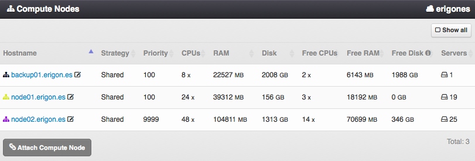
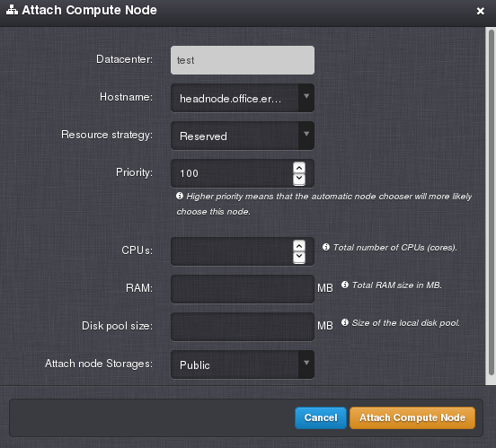

.. _dc_node:
.. _dc_attach_node:

Compute Nodes
#############

A :ref:`Compute Node <nodes>` is a set of computing resources (CPU, RAM, HDD), which are tied to actual physical hardware (server).

=============================== ================
:ref:`Access Permissions <acl>`
------------------------------- ----------------
*SuperAdmin*                    read-write
*DCAdmin*                       read-only
=============================== ================

.. note:: In the upper right corner is a button labeled ``Show All``, which can be used to display all compute nodes, including compute nodes that are not associated with the current working virtual data center.

Compute Node Parameters
=======================

* **Hostname** - Compute node name (read-only).
* **Strategy** - Strategy used for allocation of compute node's resources in a virtual data center. One of:

    * *Shared* (with other virtual data centers),
    * *Shared with limit* (same as *Shared*, but with upper boundaries),
    * *Reserved* (resources are dedicated to a virtual data center).
* **Priority** - Priority used by the algorithm for automatic selection of compute nodes. Higher priority means that the compute node will more likely be chosen when deploying a new virtual server with compute node set to *auto*.
* **CPUs** - Maximum number of remaining compute node's vCPUs available for virtual servers in this virtual data center (read-only).
* **RAM** - Maximum amount (MB) of remaining compute node's RAM available for virtual servers in this virtual data center (read-only).
* **Disk** - Maximum disk size of remaining compute node's local *zones* storage available for virtual servers in this virtual data center (read-only).
* **Free CPUs** - Number of compute node's free vCPUs available for virtual servers in this virtual data center (read-only).
* **Free RAM** - Free amount (MB) compute node's RAM available for virtual servers in this virtual data center (read-only).
* **Free Disk** - Free disk capacity of compute node's local *zones* storage available for virtual servers in this virtual data center (read-only).
* **Servers** - Total number of virtual servers and replicas defined on a compute node in a particular virtual data center. The number displayed in parentheses represents the amount of actual virtual servers excluding replicas (read-only).

.. note:: The displayed free disk space of compute node's local storage *zones* may not include the size of disk images, snapshots and backups depending on the resource allocation strategy:

    * In case of a *Reserved* strategy, the free disk space does not include the size of disk images, snapshots and backups.
    * In case of a *Shared with limit* strategy, the free disk space does not include the size of disk images, snapshot and backups. The size of snapshots and backups is subtracted only if the actual storage free space is lower than the free space calculated from the limit.
    * In all other cases, the free disk space does not include the size of disk images and some snapshots.

Attaching a Compute Node
========================

Used for associating a compute node with a virtual data center. Depending on the chosen *Strategy*, the following attributes may be required:

    * **CPUs** - Maximum (*Shared with limit* strategy) or reserved (*Reserved* strategy) number of compute node's vCPUs available for virtual servers.
    * **RAM** - Maximum (*Shared with limit* strategy) or reserved (*Reserved* strategy) amount (MB) of compute node's RAM available for virtual servers.
    * **Disk size** - Maximum (*Shared with limit* strategy) or reserved (*Reserved* strategy) disk capacity of compute node's local *zones* storage available for virtual servers.

        .. note:: Setting the disk capacity reservation or limit in a virtual data center is related only to the local data storage of a compute node - the *zones* pool.

        .. note:: It is possible to append units (e.g. ``g`` or ``G``) after the number. A JavaScript function will immediately change the value into an appropriate number in MB (e.g. ``20g`` will be changed to ``20480``).

Detaching a Compute Node
========================

A compute node can be removed from a virtual data center only when there are no :ref:`virtual servers <vms>` or :ref:`server backups <vm_backups>` associated with the compute node in the virtual data center from which it is being removed.
