.. _dc_settings:

Settings
########

Virtual data centers and the *Danube Cloud* system itself can be configured via virtual data center settings. There are two kinds of settings:

* *Global DC settings* - Global settings have an impact on the behavior of all virtual data centers and the *Danube Cloud* system, including objects that cannot be associated with a virtual data center (compute nodes). These settings can be modified in the default *main* virtual data center.
* *Local DC settings* - Local DC settings affect an actual virtual data center and can be modified in every virtual data center.

=============================== ================
:ref:`Access Permissions <acl>`
------------------------------- ----------------
*SuperAdmin*                    read-write
=============================== ================

.. note:: A newly created virtual data center inherits all settings from the default *main* data center.

.. note:: In the upper right corner is a button labeled ``Show All``, which can be used to display all settings, including global options.

.. _dc_modules:

Danube Cloud Modules
====================

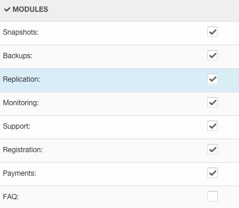

* **VMS_VM_SNAPSHOT_ENABLED** - :ref:`Snapshots <vm_snapshots>`.
* **VMS_VM_BACKUP_ENABLED** - :ref:`Backups <vm_backups>`.
* **VMS_VM_REPLICATION_ENABLED** - :ref:`Replication <vm_replication>`.
* **MON_ZABBIX_ENABLED** - :ref:`Monitoring <monitoring>`.
* **DNS_ENABLED** - :ref:`FAQ <dns>` .
* **SUPPORT_ENABLED** - :ref:`Support <add_ticket>`.
* **REGISTRATION_ENABLED** - Registration.
* **PAYMENTS_ENABLED** - Payments and billing.
* **FAQ_ENABLED** - :ref:`FAQ <faq>` .

.. note:: The *Registration* module depends on the *SMS* module.

.. note:: The *Payments* and *Replication* modules are available only in the *Danube Cloud Enterprise Edition*.

Global Danube Cloud Modules
===========================

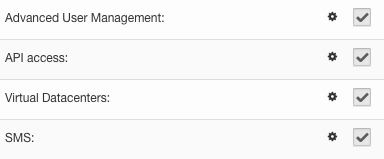

* **ACL_ENABLED** - :ref:`Advanced User Management <acl>`.
* **API_ENABLED** - :ref:`API <api>` access.
* **VMS_DC_ENABLED** - :ref:`Virtual data centers <dcs>`.
* **SMS_ENABLED** - :ref:`Text messages <sms_settings>`.

.. note:: The *SMS* module is required by the *Registration* module.

Email and DC Identity Settings
==============================

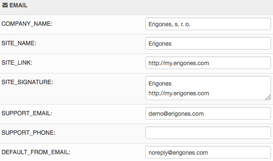

* **COMPANY_NAME** - Name of the company using this virtual data center.
* **SITE_NAME** - Name of this site; used mostly in email and text message templates.
* **SITE_LINK** - Link to this site; used mostly in email and text message templates.
* **SITE_SIGNATURE** - Signature attached to outgoing emails related to this virtual data center.
* **SITE_LOGO** - URL pointing to an image, which will be displayed as a logo on the main page. If empty the default Danube Cloud logo will be used.
* **SITE_ICON** - URL pointing to an image, which will be displayed as an icon in the navigation bar. If empty the default Danube Cloud icon will be used.
* **SUPPORT_EMAIL** - Destination email address used for all support tickets related to this virtual data center.
* **SUPPORT_PHONE** - Phone number displayed in the support contact details.
* **SUPPORT_USER_CONFIRMATION** - Whether to send a confirmation email to the user after a support ticket has been sent to *SUPPORT_EMAIL*.
* **DEFAULT_FROM_EMAIL** - Email address used as the *From* address for all outgoing emails related to this virtual data center.
* **EMAIL_ENABLED** - Whether to completely disable sending of emails related to this virtual data center.

Global Email and DC Identity Settings
=====================================

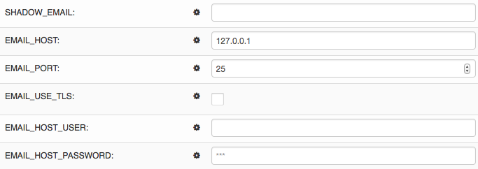

* **EMAIL_HOST** - Hostname or IP address of the SMTP server used for all outgoing emails.
* **EMAIL_PORT** - Port of the SMTP server.
* **EMAIL_USE_TLS** - Whether to use an explicit TLS (secure) SMTP connection (STARTTLS, generally used on port 587).
* **EMAIL_USE_SSL** - Whether to use an implicit TLS (secure) SMTP connection (usually used on port 465).
* **EMAIL_HOST_USER** - Username for SMTP authentication.
* **EMAIL_HOST_PASSWORD** - Password for SMTP authentication.
* **SHADOW_EMAIL** - Email address to which hidden copies of all outgoing emails are sent.

.. note:: The integrated email server is available at the IP address ``127.0.0.1`` and port ``25``.

Global User Account Settings
============================

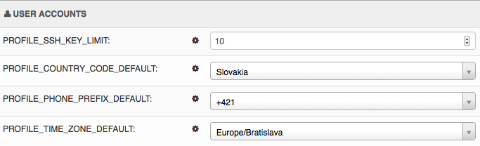

* **PROFILE_SSH_KEY_LIMIT** - Maximum number of public SSH keys that can be stored in one user profile.
* **PROFILE_COUNTRY_CODE_DEFAULT** - Default country in user's profile.
* **PROFILE_PHONE_PREFIX_DEFAULT** - Default country phone prefix in user's profile.
* **PROFILE_TIME_ZONE_DEFAULT** - Default time zone in user's profile.

.. note:: Default country, phone prefix and time zone settings can be automatically set by IP address geolocation functionality in the registration view.

Global Compute Nodes Settings
=============================

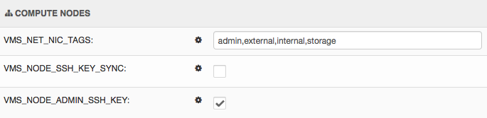

* **VMS_NODE_SSH_KEYS_SYNC** - **WARNING: Do not disable this unless you know what you are doing!**
* **VMS_NODE_SSH_KEYS_DEFAULT** - List of public SSH keys added to every compute node.

.. _dc_vm_settings:

Virtual Server Settings
=======================

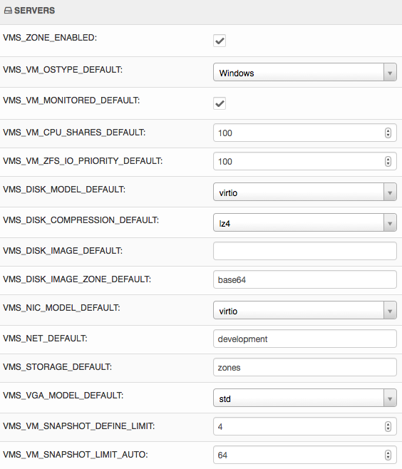

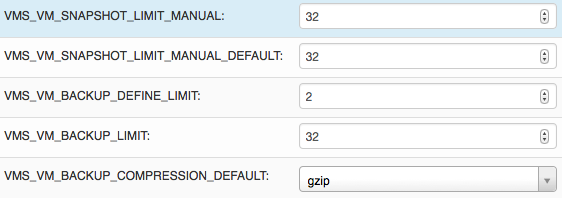

* **VMS_ZONE_ENABLED** - Whether to enable support for SunOS and Linux zones in this virtual data center.
* **VMS_VM_DEFINE_LIMIT** - Maximum number of virtual servers that can be defined in this virtual data center.
* **VMS_VM_CPU_CAP_AUTO** - Affects the behaviour of virtual server's virtual CPU count (``vcpus``) and node CPU limit (``cpu_cap``).

    * When enabled, the virtual CPU count (``vcpus``) parameter is always required. The node CPU limit (``cpu_cap``) is read-only and set automatically based on this formula: ``(vcpus * VMS_VM_CPU_BURST_RATIO * 100) + VMS_VM_CPU_BURST_DEFAULT``, where *VMS_VM_CPU_BURST_RATIO* is by default 1.0 and *VMS_VM_CPU_BURST_DEFAULT* is by default 100 when ``vcpus > 1`` and 50 when ``vcpus == 1``.
    * When disabled, the virtual CPU count (``vcpus``) parameter is required only for KVM virtual servers and ignored for SunOS and Linux zones. The node CPU limit (``cpu_cap``) can be set manually and for a new virtual server it is by default set to *VMS_VM_CPU_CAP_DEFAULT*.

    .. warning:: Disabling *VMS_VM_CPU_CAP_AUTO* affects compute node CPU resource accounting in a virtual data center. When *VMS_VM_CPU_CAP_AUTO* is disbled, the CPU node limit can be 0, which won't substract any CPU amount from free compute node resources.

* **VMS_VM_CPU_CAP_DEFAULT** - Default value for virtual server's node CPU limit (``cpu_cap``) when *VMS_VM_CPU_CAP_AUTO* is disabled. A value of 0 means no CPU limit.
* **VMS_VM_STOP_TIMEOUT_DEFAULT** - Default time period (in seconds) for a graceful stop or reboot, after which a force stop/reboot is send to the VM (KVM only).
* **VMS_VM_STOP_WIN_TIMEOUT_DEFAULT** - This is the same setting as *VMS_VM_STOP_TIMEOUT_DEFAULT*, but for a VM with Windows OS type, which usually takes longer to shut down.
* **VMS_VM_OSTYPE_DEFAULT** - Default operating system type. One of: *Linux VM*, *Windows VM*, *BSD VM*, *SunOS VM*, *SunOS Zone*, *Linux Zone*.
* **VMS_VM_MONITORED_DEFAULT** - Controls whether server synchronization with the monitoring system is enabled by default.
* **VMS_VM_CPU_SHARES_DEFAULT** - Default value of the server's CPU shares, relative to other servers. A higher value indicates a higher priority for allocation of CPU time. The default value for all virtual servers is 100.
* **VMS_VM_ZFS_IO_PRIORITY_DEFAULT** - Default value of the server's IO throttling priority, relative to other servers. A higher value indicates a higher priority for allocation of IO resources. The default value for all virtual servers is 100.
* **VMS_DISK_MODEL_DEFAULT** - Default disk model of newly created server disks. One of: *virtio*, *ide*, *scsi*.

    .. note:: It is recommended to use the *virtio* driver, which provides the highest performance and reduces consumption of CPU time. Some operating systems require additional installation of the *virtio* driver.

* **VMS_DISK_COMPRESSION_DEFAULT** - Default disk compression algorithm. One of: *off*, *lzjb*, *gzip-[1-9]*, *zle*, *lz4*.

    .. note:: The recommended compression type is LZ4.

    .. note:: Compression can utilize unused CPU time to increase the speed of reading and writing data, while saving disc space.

* **VMS_DISK_IMAGE_DEFAULT** - Name of the default disk image used for newly created server disks.
* **VMS_DISK_IMAGE_ZONE_DEFAULT** - Name of the default disk image used for newly created SunOS zone virtual servers.
* **VMS_DISK_IMAGE_LX_ZONE_DEFAULT** - Name of the default disk image used for newly created Linux zone virtual servers.
* **VMS_NIC_MODEL_DEFAULT** - Default virtual NIC model of newly created server NICs. One of: *virtio*, *e1000*, *rtl8139*.

    .. note:: It is recommended to use the *virtio* driver, which provides the highest performance and reduces consumption of CPU time. Some operating systems require additional installation of the *virtio* driver.

* **VMS_NIC_MONITORING_DEFAULT** - Default NIC ID, which will be used for external monitoring.
* **VMS_NET_DEFAULT** - Name of the default network used for newly created server NICs.
* **VMS_STORAGE_DEFAULT** - Name of the default storage used for newly created servers and server disks.
* **VMS_VGA_MODEL_DEFAULT** - Default VGA emulation driver of newly created servers. One of: *std*, *cirrus*, *vmware*.
* **VMS_VM_SSH_KEYS_DEFAULT** - List of public SSH keys added to every virtual machine in this virtual data center.
* **VMS_VM_MDATA_DEFAULT** - Default virtual server metadata (key=value string pairs).
* **VMS_VM_SNAPSHOT_DEFINE_LIMIT** - Maximum number of snapshot definitions per server.
* **VMS_VM_SNAPSHOT_LIMIT_AUTO** - Maximum number of automatic snapshots per server.
* **VMS_VM_SNAPSHOT_LIMIT_MANUAL** - Maximum number of manual snapshots per server.
* **VMS_VM_SNAPSHOT_LIMIT_MANUAL_DEFAULT** - Predefined manual snapshot limit for new servers.
* **VMS_VM_SNAPSHOT_SIZE_LIMIT** - Maximum size (MB) of all snapshots per server.
* **VMS_VM_SNAPSHOT_SIZE_LIMIT_DEFAULT** - Predefined snapshot size limit (MB) for new servers.
* **VMS_VM_SNAPSHOT_DC_SIZE_LIMIT** - Maximum size (MB) of all snapshots in this virtual data center.
* **VMS_VM_BACKUP_DEFINE_LIMIT** - Maximum number of backup definitions per server.
* **VMS_VM_BACKUP_LIMIT** - Upper retention limit used for new backup definitions.
* **VMS_VM_BACKUP_DC_SIZE_LIMIT** - Maximum size (MB) of all backups in this virtual data center.
* **VMS_VM_BACKUP_COMPRESSION_DEFAULT** - Predefined compression algorithm for new file backups. One of: *off* (no compression), *gzip* (fast compression), *bzip2* (more effective compression).
* **VMS_VM_REPLICA_RESERVATION_DEFAULT** - Default status of VM replica\'s resource (vCPU, RAM) reservation setting. By default, the resource reservation is enabled in order to have the vCPU and RAM available for future failover operation.

.. _dc_network_settings:

Network Settings
================

* **VMS_NET_LIMIT** - Maximum number of DC-bound networks that can be created in this virtual data center.
* **VMS_NET_VLAN_RESTRICT** - Whether to restrict VLAN IDs to the *VMS_NET_VLAN_ALLOWED* list.
* **VMS_NET_VLAN_ALLOWED** - List of VLAN IDs available for newly created DC-bound networks in this virtual data center.
* **VMS_NET_VXLAN_RESTRICT** - Whether to restrict VXLAN IDs to the *VMS_NET_VXLAN_ALLOWED* list.
* **VMS_NET_VXLAN_ALLOWED** - List of VXLAN IDs available for newly created DC-bound overlay networks in this virtual data center.

.. _dc_image_settings:

Disk Image Settings
===================

* **VMS_IMAGE_LIMIT** - Maximum number of DC-bound server images that can be created in this virtual data center.

Global Disk Image Settings
==========================

* **VMS_IMAGE_REPOSITORIES** - Object (key=name, value=URL) with remote disk image repositories available in every virtual data center.
* **VMS_IMAGE_SOURCES** - List of additional IMGAPI sources that will be set on all compute nodes.
* **VMS_IMAGE_VM** - Global image server - primary IMGAPI source on all compute nodes. Empty value means that most of the image-related operations will be performed only in the DB.
* **VMS_IMAGE_VM_NIC** - NIC ID of global image server, which will be used to determine the IP address for constructing the IMGAPI source set on all compute nodes.

.. _dc_iso_image_settings:

ISO Image Settings
==================

* **VMS_ISO_LIMIT** - Maximum number of DC-bound ISO images that can be created in this virtual data center.

.. _dc_dns_settings:

DNS Settings
============

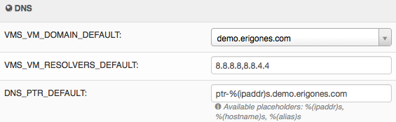

* **VMS_VM_DOMAIN_DEFAULT** - Default domain part of the hostname of a newly created virtual server.
* **VMS_VM_RESOLVERS_DEFAULT** - Default DNS resolvers used for newly created virtual servers.
* **DNS_PTR_DEFAULT** - Default value used for reverse DNS records of virtual server NIC's IP addresses. Available placeholders are: ``{ipaddr}``, ``{hostname}``, ``{alias}``.

Global DNS Settings
===================

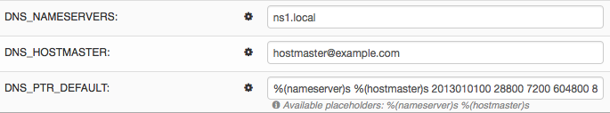

* **DNS_DOMAIN_TYPE_DEFAULT** - Default PowerDNS replication type of newly created domain.
* **DNS_HOSTMASTER** - Default hostmaster email address used for SOA records of newly created domains.
* **DNS_NAMESERVERS** - List of DNS servers used for NS records of newly created domains. Set to an empty list to disable automatic creation of NS records.
* **DNS_SOA_DEFAULT** - Default value for the SOA record of newly created domains. Available placeholders are: ``{nameserver}`` (replaced by first nameserver in *DNS_NAMESERVERS*) and ``{hostmaster}`` (replaced by *DNS_HOSTMASTER*). Set to an empty value to disable automatic creation of SOA records.

.. _dc_monitoring_setup:
.. _dc_monitoring_settings:

Monitoring Settings
===================

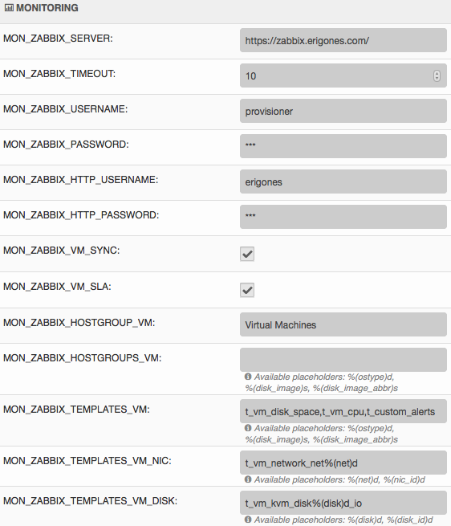

.. warning:: Changing the monitoring server and monitoring settings in the default *main* virtual data center affects the :ref:`internal (main) monitoring server <main_monitoring>` and settings in all virtual data centers. Changing the monitoring server and monitoring settings in other virtual data centers can be used to configure a :ref:`dedicated monitoring server for a virtual data center <dc_monitoring>`.

.. warning:: Virtual data centers *main* and *admin* require the :ref:`central (main) monitoring server <main_monitoring>` for correct functioning. Changing monitoring server for these virtual data centers will cause failure of the *Danube Cloud* monitoring system.

* **MON_ZABBIX_SERVER** - URL address of Zabbix server used for external monitoring of servers in this virtual data center. **WARNING:** Changing this and other MON_ZABBIX_* values in the default (*main*) virtual data center will affect the built-in internal monitoring of servers and compute nodes.
* **MON_ZABBIX_SERVER_SSL_VERIFY** - Whether to perform HTTPS certificate verification when connecting to the Zabbix API.
* **MON_ZABBIX_TIMEOUT** - Timeout in seconds used for connections to the Zabbix API.
* **MON_ZABBIX_USERNAME** - Username used for connecting to the Zabbix API.
* **MON_ZABBIX_PASSWORD** - Password used for connecting to the Zabbix API.
* **MON_ZABBIX_HTTP_USERNAME** - Username used for the HTTP basic authentication required for connections to the Zabbix API.
* **MON_ZABBIX_HTTP_PASSWORD** - Password used for the HTTP basic authentication required for connections to the Zabbix API.
* **MON_ZABBIX_VM_SLA** - Whether to fetch and display the SLA value of virtual servers.
* **MON_ZABBIX_VM_SYNC** - Whether newly created virtual servers can be automatically synchronized with the monitoring server.
* **MON_ZABBIX_HOSTGROUP_VM** - Existing Zabbix host group, which will be used for all monitored servers in this virtual data center.
* **MON_ZABBIX_HOSTGROUPS_VM** - List of other existing Zabbix host groups, which will be used for all monitored servers in this virtual data center. Available placeholders are: ``{ostype}``, ``{ostype_text}``, ``{disk_image}``, ``{disk_image_abbr}``, ``{dc_name}``.
* **MON_ZABBIX_HOSTGROUPS_VM_RESTRICT** - Whether to restrict Zabbix host group names to the *MON_ZABBIX_HOSTGROUPS_VM_ALLOWED* list.
* **MON_ZABBIX_HOSTGROUPS_VM_ALLOWED** - List of Zabbix host groups that can be used by servers in this virtual data center. Available placeholders are: ``{ostype}``, ``{ostype_text}``, ``{disk_image}``, ``{disk_image_abbr}``, ``{dc_name}``.
* **MON_ZABBIX_TEMPLATES_VM** - List of existing Zabbix templates, which will be used for all monitored servers in this virtual data center. Available placeholders are: ``{ostype}``, ``{ostype_text}``, ``{disk_image}``, ``{disk_image_abbr}``, ``{dc_name}``.
* **MON_ZABBIX_TEMPLATES_VM_MAP_TO_TAGS** - Whether to find and use existing Zabbix templates according to tags of a monitored virtual server.
* **MON_ZABBIX_TEMPLATES_VM_RESTRICT** - Whether to restrict Zabbix template names to the *MON_ZABBIX_TEMPLATES_VM_ALLOWED* list.
* **MON_ZABBIX_TEMPLATES_VM_ALLOWED** - List of Zabbix templates that can be used by servers in this virtual data center. Available placeholders are: ``{ostype}``, ``{ostype_text}``, ``{disk_image}``, ``{disk_image_abbr}``, ``{dc_name}``.
* **MON_ZABBIX_TEMPLATES_VM_NIC** - List of Zabbix templates that will be used for all monitored servers, for every virtual NIC of a server. Available placeholders are: ``{net}``, ``{nic_id}`` + *MON_ZABBIX_TEMPLATES_VM* placeholders.
* **MON_ZABBIX_TEMPLATES_VM_DISK** - List of Zabbix templates that will be used for all monitored servers, for every virtual disk of a server. Available placeholders: ``{disk}``, ``{disk_id}`` + *MON_ZABBIX_TEMPLATES_VM* placeholders.
* **MON_ZABBIX_HOST_VM_PROXY** - Name or ID of the monitoring proxy, which will be used to monitor all monitored virtual servers.

.. seealso:: A more detailed overview of monitoring settings in virtual data centers can be found in a separate chapter dedicated to :ref:`virtual server monitoring <dc_vm_monitoring_advanced>`.

.. seealso:: More information about the monitoring system can be found in a :ref:`separate chapter <monitoring>`.

Global Monitoring Settings
==========================

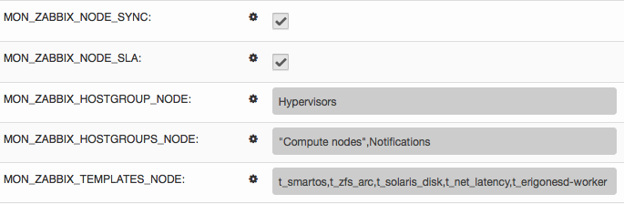

* **MON_ZABBIX_NODE_SYNC** - Whether compute nodes should be automatically synchronized with the monitoring server.
* **MON_ZABBIX_NODE_SLA** - Whether to fetch and display the SLA value of compute nodes.
* **MON_ZABBIX_HOSTGROUP_NODE** - Existing Zabbix host group, which will be used for all monitored compute nodes.
* **MON_ZABBIX_HOSTGROUPS_NODE** - List of other existing Zabbix host groups, which will be used for all monitored compute nodes.
* **MON_ZABBIX_TEMPLATES_NODE** - List of existing Zabbix templates, which will be used for all monitored compute nodes.

API Settings
============

* **API_LOG_USER_CALLBACK** - Whether to log API user callback requests into the task log.

.. _sms_settings:

Global Text Messaging (SMS) Settings
====================================

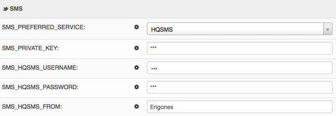

* **SMS_PREFERRED_SERVICE** - Currently used SMS provider.
* **SMS_PRIVATE_KEY** - Secure key required for sending text messages via the API.
* **SMS_SMSAPI_USERNAME** - Username required for the SMSAPI service (former HQSMS).
* **SMS_SMSAPI_PASSWORD** - Password required for the SMSAPI service (former HQSMS).
* **SMS_SMSAPI_FROM** - Phone number used for outgoing text messages sent via the SMSAPI service (former HQSMS).

.. note:: Text messages are used by *Danube Cloud* for sending user passwords and confirming phone numbers. *Danube Cloud* currently comes with integrated support for the SMS API service (former HQSMS) - https://www.smsapi.com.

Global Billing Settings
=======================

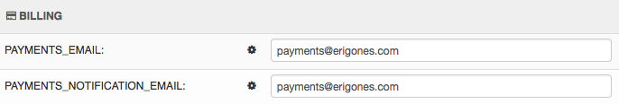

* **PAYMENTS_EMAIL** - Email address used as the *From* address for all outgoing emails sent by the payments module.
* **PAYMENTS_NOTIFICATION_EMAIL** - Email address where payment notifications are sent.

.. note:: Zabbix is a registered trademark of `Zabbix LLC <http://www.zabbix.com>`_.

.. note:: *Danube Cloud* includes GeoLite2 data created by MaxMind, available from http://www.maxmind.com.

