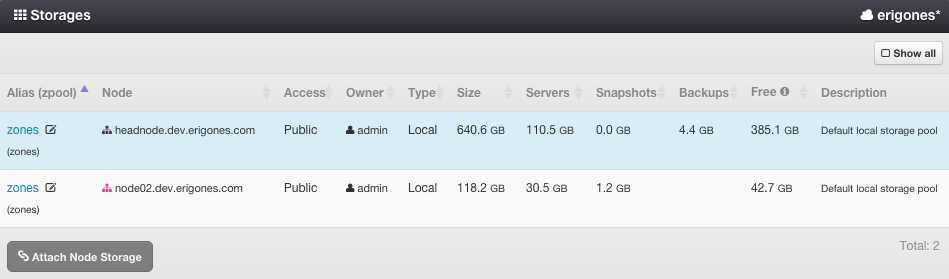
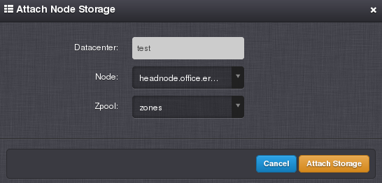

.. _dc_storages:

Node Storages
#############

A :ref:`Compute Node Storage <node_storages>` is a ZFS zpool created by connecting local or network disk drives or arrays into a compute node. Every compute node must contain at least one local zpool named *zones*, where compute node settings are being stored.

=============================== ================
:ref:`Access Permissions <acl>`
------------------------------- ----------------
*SuperAdmin*                    read-write
*DCAdmin*                       read-only
=============================== ================

.. note:: In the upper right corner is a button labeled ``Show All``, which can be used to display all node storages, including storages that are not associated with the current working virtual data center.

Node Storage Parameters
=======================

* **zpool** - Name of the ZFS zpool (read-only).
* **Alias** -  User-defined name of a node storage (read-only).
* **Node** - Compute node to which the data storage is attached to (read-only).
* **Access** - Storage visibility (read-only). One of:
    * *Public* - Storage can be used by any user in this virtual data center.
    * *Private* - Storage can be used only by *SuperAdmins* or owners of this node storage.
* **Owner** - Storage owner (read-only).
* **Type** - Node storage type (read-only). One of:

    * *Local*
    * *iSCSI*
    * *Fiber Channel*
* **Size** - Total disk capacity of a node storage (read-only).
* **Servers** - Disk space used by virtual servers, which are defined in this virtual data center (read-only).
* **Snapshots** - Disk space consumed by snapshots, which are created on disks of virtual servers defined in this virtual data center (read-only).
* **Backups** - Disk space consumed by backups, which are created from disks of virtual servers defined in this virtual data center (read-only).
* **Free** - Free disk capacity of a node storage available for virtual servers, snapshots and backups in this virtual data center (read-only).
* **Description**

.. note:: The displayed free disk space of a node storage may not include the size of disk images, snapshots and backups depending on the storage type and related compute node resource allocation strategy:

    * In case of a default local *zones* storage and *Reserved* strategy, the free disk space does not include the size of disk images, snapshots and backups.
    * In case of a default local *zones* storage and *Shared with limit* strategy, the free disk space does not include the size of disk images, snapshot and backups. The size of snapshots and backups is subtracted only if the actual storage free space is lower than the free space calculated from the limit.
    * In all other cases, the free disk space does not include the size of disk images and some snapshots.

Attaching a Node Storage
========================

Used for associating a compute node storage with a virtual data center.

Detaching a Node Storage
========================

A node storage can be removed from a virtual data center only when there are no :ref:`virtual servers <vms>` or :ref:`server backups <vm_backups>` associated with the node storage in the virtual data center from which it is being removed.
