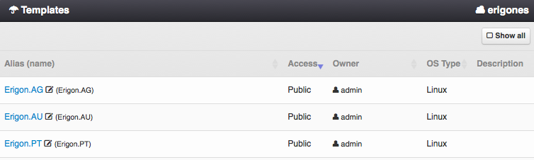

.. _dc_template:
.. _templates:

Templates
#########

A server Template is a set of pre-defined parameters and settings of a virtual server (a virtual server skeleton). It is used to simplify the initial configuration of multiple servers, which share the same configuration.

=============================== ================
:ref:`Access Permissions <acl>`
------------------------------- ----------------
*SuperAdmin*                    read-write
*DCAdmin*                       read-only
*TemplateAdmin*                 read-write (DC-bound templates only)
=============================== ================

.. note:: In the upper right corner is a button labeled :guilabel:`Show All`, which can be used to display all templates, including templates that are not associated with the current working virtual data center.

Template Parameters
===================

* **Name** - Unique template identifier (usually used in the :ref:`API <api>`).
* **Alias** - User-defined name of a template (usually displayed in the :ref:`GUI <gui>`).
* **Access** - Template visibility. One of:

    * *Public* - Template is usable by all users in this virtual data center.
    * *Private* - Template is usable by *SuperAdmins* and owners of this image.
    * *Deleted* - Template is hidden and unusable for new servers, but can be still used by some already defined servers.
* **Owner** - Template owner.
* **DC-bound?** - Whether a server template is bound to a specific virtual data center.
* **OS Type** - Operating system type. One of:

    * *Linux VM*
    * *Windows VM*
    * *BSD VM*
    * *SunOS VM*
    * *SunOS Zone*
    * *Linux Zone*
* **Description**

Managing a Template
===================

A virtual server template can be created, updated or deleted by a *SuperAdmin* or by a *TemplateAdmin* (DC-bound template only). A template that is used by some virtual machines cannot be deleted. However, its *Access* attribute can be changed to *Deleted*, thus the template will be hidden and unusable for new virtual servers.

.. note:: Management of server templates is not yet implemented in the :ref:`GUI <gui>`. Please use the proper :ref:`API <api>` function to add, update or delete a server template.

**Example 1:**
Create a VM template with:
    * 4 CPUs
    * 1 GB of RAM
    * 20 GB boot disk using the *centos-7-es-2018* image
    * 25 GB second disk with compression disabled

.. code::

    ./es create /template/mytemplate -vm_define 'json::{"vcpus": 4, "ram": 1024}' -vm_define_disk 'json::[{"image": "centos-7-es-2018", "boot": true, "size": 20240, "compression": "lz4"},{"image": "", "boot": false, "size": 25600, "compression": "off"}]'

**Example 2:**
Create a VM template with:
    * 4 CPUs
    * 20 GB of RAM
    * 10 GB boot disk using the *ubuntu-certified-16.04* image
    * 512 GB second disk with compression disabled
    * network interface attached to *mynet* network
    * backup definitions for both disks to backup node *backup02.example.com* with fsfreeze enabled (consistent backup)
    * creates a pretty-name alias for this template as *Kafka-standard*
    * attaches the created template to virtual datacenter *MYDC*

.. code::

    ./es create /template/kafka-std -ostype 1 -vm_define 'json::{"vcpus": 4, "ram": 20480}' -vm_define_nic 'json::[{"net": "mynet"}]' -vm_define_disk 'json::[{"image": "ubuntu-certified-16.04", "boot": true, "size": 10240, "compression": "lz4"},{"image": "", "boot": false, "size": 524288, "compression": "off"}]' -vm_define_backup 'json::[{"node": "backup02.example.com", "name": "os", "schedule": "0 4 * * *", "zpool": "zones", "retention": 30, "fsfreeze": true, "disk_id": 1},{"node": "backup02.example.com", "name": "data", "schedule": "10 4 * * *", "zpool": "zones", "retention": 30, "fsfreeze": true, "disk_id": 2}]' -dc MYDC -alias Kafka-standard

Attaching a Template
====================

Used for associating an existing virtual server template with a virtual data center. This operation can be performed only by a *SuperAdmin*.

.. note:: A disk image can be only used when attached to a virtual data center.

Detaching a Template
====================

In order to remove an association of a virtual server template with a virtual data center, the template must not be used by any virtual machine within the virtual data center. This can be performed only by a *SuperAdmin*.

