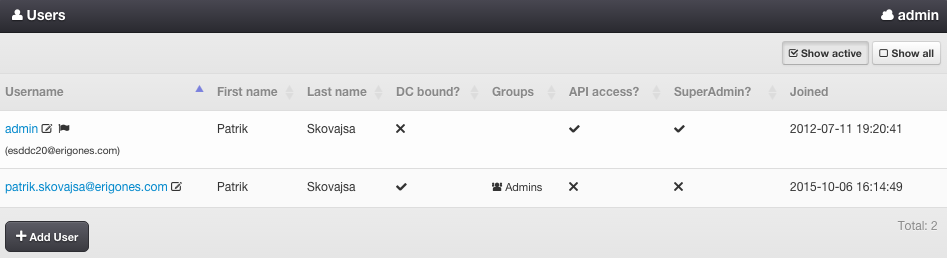
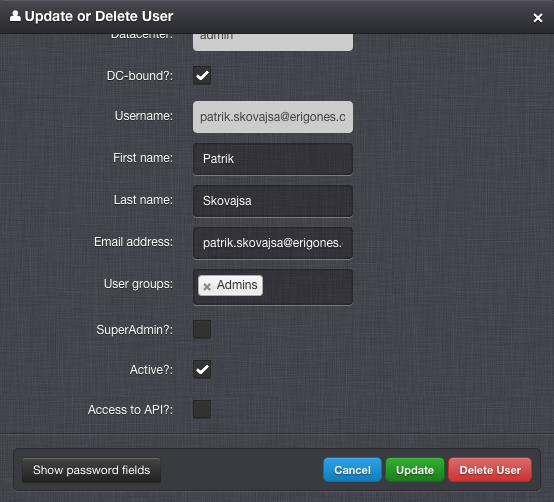

.. _dc_users:
.. _users:

Users
#####

A User represents a person with access to the *Danube Cloud* system.

=============================== ================
:ref:`Access Permissions <acl>`
------------------------------- ----------------
*SuperAdmin*                    read-write
*DCAdmin*                       read-only
*UserAdmin*                     read-write (DC-bound users only)
=============================== ================

.. note:: In the upper right corner is a button labeled ``Show All``, which can be used to display all users, including users that do not have access to the current working virtual data center.

.. seealso:: More information about user :ref:`roles and permissions <acl>`.

User Parameters
===============

* **Username** - Unique user identifier.
* **Email address** - Primary user email address.
* **First name** - User first name.
* **Last name** - User last name
* **DC Bound?** - Whether a user is bound to a specific virtual data center.
* **Groups** - List of :ref:`user groups <groups>`.
* **SuperAdmin status** - Grant user *SuperAdmin* permissions.
* **Access to API** - Allow user to access the :ref:`API <api>` via HTTP.
* **Active** - Allow user to login to *Danube Cloud*.
* **Password** - User password.
* **Joined** - The date and time when the user was created (read-only).

Managing a User
===============

A user can be created, updated, deleted by a *SuperAdmin* or by a *UserAdmin* (DC-bound users only).

.. seealso:: All user attributes and settings can be managed via the :ref:`Edit profile <user_profile>` button.

.. note:: A user can be deleted only if he has no relations to any other objects.

.. note:: User access to virtual data centers can be managed via :ref:`user groups <groups>`.

