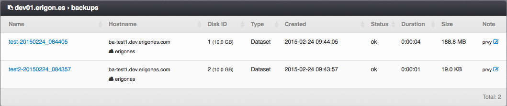
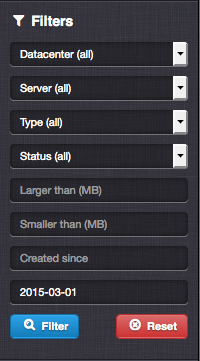
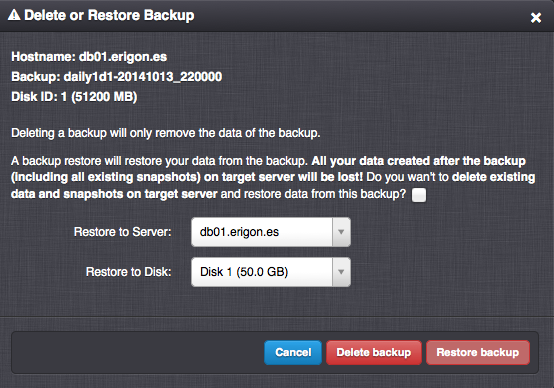

.. _node_backup:

Virtual Server Backups on Compute Node
######################################

List of virtual server backups stored on the compute node.

=============================== ================
:ref:`Access Permissions <acl>`
------------------------------- ----------------
*SuperAdmin*                    read-write
=============================== ================

.. note:: In order to use the compute node for backup purposes, the backup option needs to be enabled in the :ref:`compute node capabilities settings <compute_node>`.

Backup Parameters
=================

* **Name** - Backup name (read-only).
* **Hostname** - Virtual server hostname as it was at the time of creation of the backup (used in the :ref:`API <api>`) and the name of virtual data center the backup is associated with (read-only).
* **Disk ID** - Virtual server disk ID (read-only).
* **Type** - Backup type (read-only). One of:

    * *Dataset*
    * *File*
* **Created** - The date and time when the backup was created (read-only).
* **Status** - Backup state (read-only). One of:

    * *ok*
    * *pending*
    * *restore*
    * *lost*
* **Duration** - The amount of time spent to create the backup (read-only).
* **Size** - The size of the backup (read-only).
* **Note**

Backup Filters
==============

* **Datacenter** - Name of the virtual data center the backup is associated with.
* **Server** - Virtual server hostname for which the backup was created.
* **Type** - Backup type. One of:

    * *Dataset*
    * *File*
* **Status** - Backup state. One of:

    * *ok*
    * *pending*
    * *restore*
    * *lost*
* **Larger than (MB)** - Display backups larger than a specific size.
* **Smaller than (MB)** - Display backups smaller than a specific size>
* **Created since** - Display backups created after a specific date.
* **Created until** - Display backups created before a specific date.

.. note:: It is possible to display backups of non-existing virtual servers by choosing the *(no server)* option in the **Server** filter.

Restoring and Deleting Backups
==============================

It is possible to perform the delete or restore operations only when backups for a particular virtual server are displayed. Please use the backup filters to display backups for a specific server.

* **Delete backup** - Remove data of the backup.

    .. note:: Removal of a backup deletes only the backup data.

    .. note:: Mass deletion is only possible for backups of a specific virtual server having the same disk ID.

* **Restore backup** - Restore server disk data from the backup to the existing virtual server disk or a disk of an another virtual server.

    .. warning:: A backup restore results in all data loss on the target virtual server and disk, including all virtual server's snapshots.

