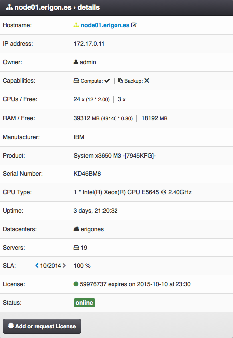
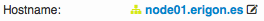
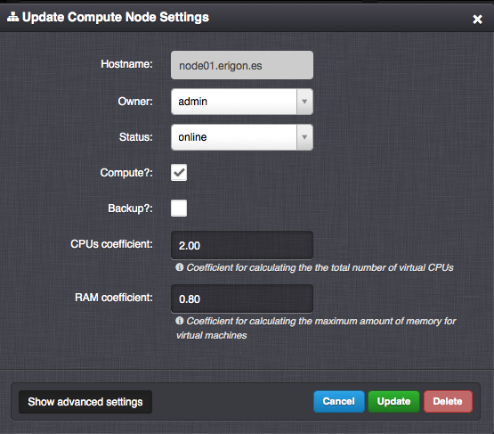
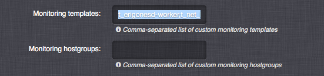
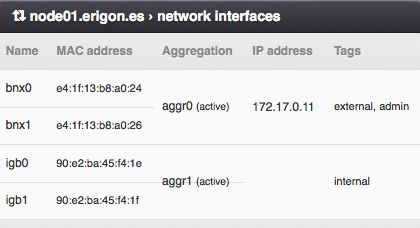
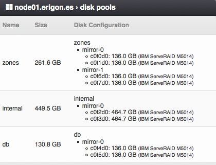

.. _compute_node:

Compute Node Details
####################

A Compute Node is a set of computing resources (CPU, RAM, HDD), which are tied to actual physical hardware (server).

=============================== ================
:ref:`Access Permissions <acl>`
------------------------------- ----------------
*SuperAdmin*                    read-write
=============================== ================

.. warning:: A compute node must be switched to the *maintenance* state before initiating its shutdown or restart procedure.

.. note:: Shutdown or restart of a compute node initiates a shutdown of all virtual servers running on the compute node (virtual servers must have a functional ACPI daemon running). After booting the compute node, the virtual servers will return to the same state as they were before the shutdown or restart of the compute node.

.. note:: A compute node with a flag icon appended to its hostname is the main head node.

.. note:: The compute node hostname cannot be changed retrospectively.

.. note:: After a successful installation, the compute node will appear in the web interface automatically.

.. seealso:: A compute node can be only used when :ref:`attached to a virtual data center <dc_attach_node>`.

.. seealso:: Working with virtual servers is possible only on a compute node with a :ref:`valid Compute Node License <node_license>` (*Danube Cloud Enterprise Edition*).

Compute Node Parameters
=======================

* **Hostname** - Unique compute node identifier (read-only).
* **IP address** - Primary IP address (read-only).
* **Owner** - Compute node owner.
* **Capabilities** - Combination of:

    * *Compute* - The node can be used for :ref:`virtual servers <vms>`.,
    * *Backup* - The node can be used for :ref:`storing backups <storage_backup>`.

    .. warning:: If the compute node is also a backup node, it is necessary to store backups of virtual machines onto another backup node.

* **CPUs / Free**

    * Total number of compute node's virtual CPUs usable for virtual servers.
    * Number of compute node's free virtual CPUs available for virtual servers (read-only).
* **RAM / Free**

    * Total amount (MB) of compute node's RAM usable for virtual servers.
    * Free amount (MB) compute node's RAM available for virtual servers (read-only).
* **Manufacturer** - Compute node physical server manufacturer (read-only).
* **Product** - Physical server model (read-only).
* **Serial Number** - Serial number of the physical server (read-only).
* **CPU Type** - Physical server CPU model (read-only).
* **Uptime**
* **Datacenters** - List of :ref:`virtual data centers <dcs>` the compute node is attached to.
* **Servers** - Total number of virtual servers and replicas defined on the compute node. The number displayed in parentheses represents the amount of actual virtual servers excluding replicas (read-only).
* **SLA** - Monthly SLA (read-only). Can be enabled/disabled via :ref:`global monitoring DC settings <dc_monitoring_settings>`.
* **License** - License ID and expiration time (read-only).
* **Status** - One of:

    * *online*
    * *maintenance*
    * *unreachable*
    * *unlicensed*

.. _compute_node_settings:

Managing a Compute Node
=======================

    The modal window opens after clicking on the compute node's hostname.

.. note:: Some compute node settings (e.g. network and storage configuration) must be changed directly on the compute node. After manually modifying settings directly on the compute node, the :ref:`compute node's system information must be refreshed <node_actions>` in the *Danube Cloud* web management.

Advanced Compute Node Settings
------------------------------

* **CPUs coefficient** - Coefficient used to calculate the total number of compute node's virtual CPUs usable for virtual servers by multiplying with the number of physical CPU cores.

    .. warning:: A CPU coefficient larger than **1** may cause an unexpected slowdown of virtual servers in case the compute node is over-provisioned with large number of CPU intensive virtual servers. It is recommended to actively monitor the overall CPU load of affected compute nodes. If necessary, it is required to lower the CPU coefficient and move some virtual servers to another compute node.

* **RAM coefficient** - Coefficient used to calculate the total amount of compute node's RAM usable for virtual servers by multiplying with the actual physical RAM size. The coefficient must be lower than 1 because the compute node's RAM is also used by the operating system of the hypervisor, KVM overhead and file system read cache (ARC).

    .. warning:: The RAM coefficient must be lower than **1** in order to make some memory available for the ZFS cache, which increases the speed of read operations from hard drives (ARC), thus increase the overall I/O performance of the compute node. The RAM coefficient also depends on the number of virtual servers running on the compute node because each KVM virtual server requires additional 256 MB to 1024 MB of RAM (KVM overhead).

.. note:: Incorrect setting of CPU and RAM coefficients may result in displaying negative values of free compute node's resources.

* **Monitoring templates** - List of existing Zabbix templates that will be attached to the compute node host in the monitoring system.

* **Monitoring hostgroups** - List of existing Zabbix host groups that the compute node host will be assigned to.

.. _node_actions:

Compute Node Actions
====================

* **Add or request License** - Used for creating requests for compute node licenses and for adding issued licenses to compute nodes. 

    .. seealso:: More information about licenses can be found in chapter :ref:`Compute Node Licenses <node_license>`

* **Refresh** - Detects changes and updates compute node's information if there were any changes, e.g. changes in disk pools or network interfaces.

Compute Node Network Interfaces
===============================

Configuration of network interface cards connected to the compute node.

**Parameters**

* **Name** - Network card identifier.
* **MAC address** - Network card MAC address.
* **Aggregation** - Name of the virtual aggregated (802.3ad) network interface.
* **IP address**
* **Tags** - List of NIC tags attached to the network interface. A NIC tag is a logical name assigned to a physical or virtual network interface used to designate network traffic from virtual networks to physical adapters.
  

Compute Node Disk Pools
=======================

Configuration of physical disks and disk pools.

**Parameters**

* **Name** - Name of the disk pool (zpool).
* **Size** - Total capacity of the zpool.
* **Disk Configuration**:

    * Zpool name and group.
    * :ref:`Zpool type (RAID level) <storage_redundancy>`.
    * Names, types and sizes of physical disks attached to the zpool.

.. seealso:: In order to be able to use a disk pool (zpool) in *Danube Cloud*, a :ref:`node storage <node_storages>` has to be created from it.

