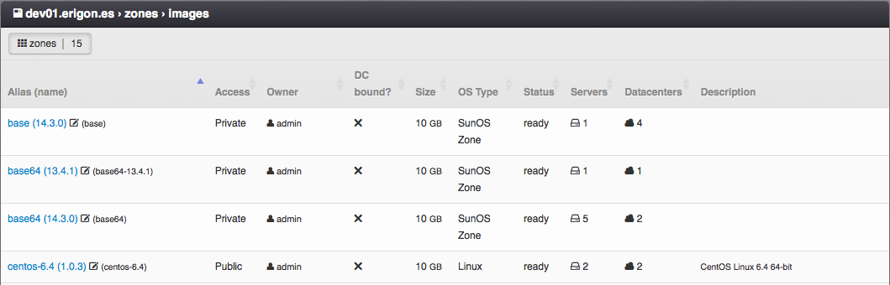

Images on Compute Node
######################

List of disk images imported onto a compute node's storage. These images are ready to be used by virtual servers created on the same node storage.

=============================== ================
:ref:`Access Permissions <acl>`
------------------------------- ----------------
*SuperAdmin*                    read-write
=============================== ================

Image Parameters
================

* **Alias (name)** - Unique image identifier (usually used in the :ref:`API <api>`), user-defined name of an image (usually displayed in the :ref:`GUI <gui>`) and image version.
* **Access** - Image visibility. One of:

    * *Public* - Image is usable by all users in this virtual data center.
    * *Private* - Image is usable by *SuperAdmins* and owners of this image.
    * *Deleted* - Image is hidden and unusable for new servers, but can be still used by some already defined servers.
* **Owner** - Image owner.
* **DC-bound?** - Whether a disk image is bound to a specific virtual data center.
* **Size** - Minimal virtual disk size required by a disk image (read-only).
* **OS Type** - Operating system type (read-only). One of:

    * *Linux VM*
    * *Windows VM*
    * *BSD VM*
    * *SunOS VM*
    * *SunOS Zone*
* **Status** - Current state of a disk image (read-only). One of:

    * *ok* - Image is ready to use.
    * *pending* - Image is being created, updated or deleted.
* **Servers** - Number of virtual servers, which use the image for their disk.
* **Datacenters** - Number of :ref:`virtual data centers <dcs>` the disk image is attached to.
* **Description**

Importing an Image To a Compute Node Storage
============================================

The import of images is carried out **automatically** before deploying the virtual server onto the compute node.

.. note:: It is possible to manually import a disk image by using a proper :ref:`API function <api>`.

Removing an Image From a Compute Node Storage
=============================================

Unused disk images can be removed from a node storage in two ways:

* Removing a specific disk image form a node storage

  .. image:: img/node_storage_image_delete.png

* Removing all unused disk images from a node storage by using the *Delete unused images* action.
