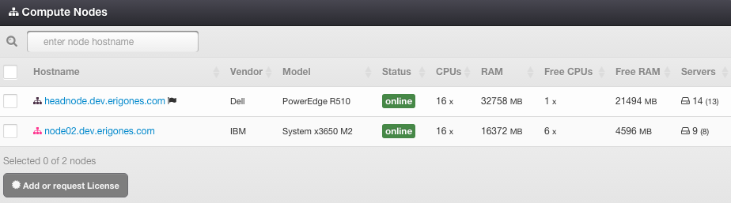

Compute Node List
#################

A Compute Node is a set of computing resources (CPU, RAM, HDD), which are tied to actual physical hardware (server).

=============================== ================
:ref:`Access Permissions <acl>`
------------------------------- ----------------
*SuperAdmin*                    read-write
=============================== ================

Compute Node List Item Parameters
=================================

* **Hostname** - Unique compute node identifier (read-only).
* **Vendor** - Compute node server manufacturer (read-only).
* **Model** - Compute node physical server model (read-only).
* **Status** - One of:

    * *online*
    * *offline*
    * *unreachable*
    * *unlicensed*
* **CPUs** - Total number of compute node's virtual CPUs usable for virtual servers.
* **RAM** - Total amount (MB) of compute node's RAM usable for virtual servers.
* **Free CPUs** - Number of compute node's free virtual CPUs available for virtual servers (read-only).
* **Free RAM** - Free amount (MB) compute node's RAM available for virtual servers (read-only).
* **Servers** - Total number of virtual servers and replicas defined on a compute node. The number displayed in parentheses represents the amount of actual virtual servers excluding replicas (read-only).

