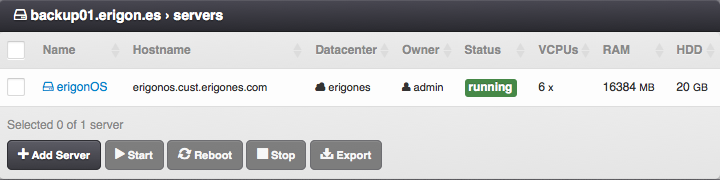

Virtual Servers on Compute Node
###############################

List of virtual servers defined on the compute node.

=============================== ================
:ref:`Access Permissions <acl>`
------------------------------- ----------------
*SuperAdmin*                    read-write
=============================== ================

.. note:: Virtual servers whose hostname begin with a ``_`` (underscore) character are replicas of virtual servers.

.. seealso:: More information about virtual server can be found in the :ref:`server list section <server-list>`, which is part of the :ref:`virtual servers chapter <vms>`.
