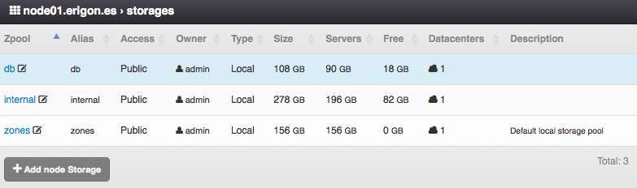
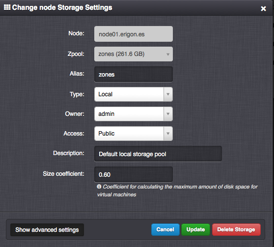

.. _node_storages:

Compute Node Storages
#####################

=============================== ================
:ref:`Access Permissions <acl>`
------------------------------- ----------------
*SuperAdmin*                    read-write
=============================== ================

Compute Node Storage Parameters
===============================

* **Zpool** - The actual name of the zpool (usually used in the :ref:`API <api>`, read-only).
* **Alias** - User-defined name of the node storage (usually displayed in the :ref:`GUI <gui>`).
* **Access** - Node storage visibility. One Of:

    * *Public* - Storage is usable by all users in a virtual data center.
    * *Private* - Storage is usable by *SuperAdmins* and the storage owner in a virtual data center.
* **Owner** - Node storage owner.
* **Type** - Storage type. One of:

     * *Local*
     * *iSCSI*
     * *Fiber Channel*
* **Size** - Total disk capacity of a node storage (read-only).
* **Servers** - Storage space used by virtual servers (read-only).
* **Backups** - Storage space consumed by backups (read-only). Displayed only on a backup node.
* **Snapshots** - Storage space consumed by snapshots (read-only).
* **Free** - Free disk capacity of a node storage available for virtual servers, snapshots and backups (read-only).
* **Datacenters** -  Total number of :ref:`virtual data centers <dcs>` the node storage is attached to (read-only).
* **Description**

.. _node_storage_settings:

Managing a Compute Node Storage
===============================

.. note:: Compute node storage settings must be changed directly on the compute node. After manually configuring storage settings directly on the compute node, the :ref:`compute node's system information must be refreshed <node_actions>` in the *Danube Cloud* web management.

Advanced Compute Node Storage Settings
--------------------------------------

* **Size coefficient:** - Coefficient used to calculate the total size of the compute node's storage usable for virtual servers, snapshots and backups by multiplying the actual size of the associated zpool.

    .. warning:: The coefficient should be lower than **0.79** because after filling the storage capacity over 80% the actual I/O performance of disk writes decreases rapidly.

    .. warning:: Incorrect setting of the storage size coefficient may lead to a crash of virtual servers and/or the compute node and in the worst case even damage of a virtual server's data!

.. note:: The actual disk space is also consumed by ISO images, server images and snapshots, which are not included in the resource counters within *Danube Cloud*. The actual free space of a zpool or node storage should be closely monitored by the monitoring system included in *Danube Cloud*.

.. note:: Incorrect setting of the storage size coefficient may result in displaying negative values of free compute node's resources.

