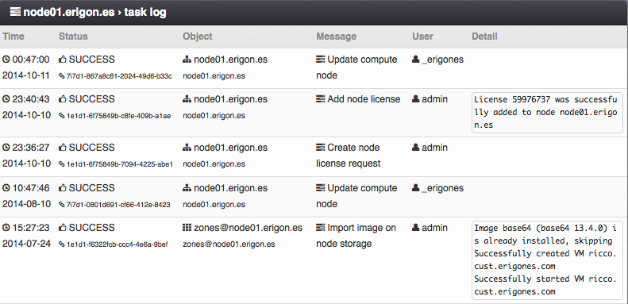

Compute Node Task Log
#####################

The compute node Task Log view displays records of individual events related to the compute node and its node storage(s).

=============================== ================
:ref:`Access Permissions <acl>`
------------------------------- ----------------
*SuperAdmin*                    read-only
=============================== ================

.. seealso:: More information about the task log can be found in a :ref:`separate chapter dedicated to the main task log view <tasklog>`.
