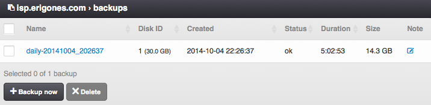
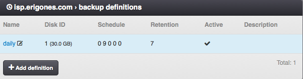
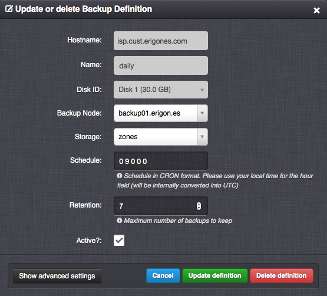
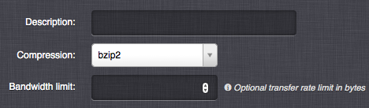

.. _vm_backups:
.. _backup:

Virtual Server Backups
######################

A Backup is a snapshot of a virtual server disk moved to an off-site location.

=============================== ================
:ref:`Access Permissions <acl>`
------------------------------- ----------------
*SuperAdmin*                    read-write
*DCAdmin*                       read-write
*VmOwner*                       read-only
=============================== ================

Backups Parameters
==================

* **Name** - Backup name (read-only).
* **Disk ID** - Virtual server disk ID (read-only).
* **Type** - Backup type (read-only). One of:

    * *Dataset*
    * *File*
* **Created** - The date and time when the backup was created (read-only).
* **Status** - Backup state (read-only). One of:

    * *ok*
    * *pending*
    * *restore*
    * *lost*

* **Duration** - The amount of time spent to create the backup (read-only).
* **Size** - The size of the backup (read-only).
* **Note**

.. note:: Backups created with the *Freeze filesystem* option enabled are marked with a flag icon appended to their *status*.

Backup Actions
==============

* **Backup now** - Immediately start a backup process based on a :ref:`backup definition <backup_definition>`.

    .. image:: img/backup_create.png

* **Delete backup** - Remove data of the backup.

    .. image:: img/backup_manage.png

* **Restore backup** - Restore server disk data from the backup to the existing virtual server disk or a disk of an another virtual server.

    .. warning:: A backup restore results in all data loss on the target virtual server and disk, including all virtual server's snapshots.

.. warning:: Backing up many virtual servers at the same time can have a high impact on the I/O load of the affected compute and backup nodes, potentially causing short or even long-term unavailability of services. A fair distribution of backup schedules in time can easily eliminate this problem. A backup definition overview of a particular virtual data center or backup node can be obtained via the :ref:`compute node backup definition view <node_backup_define>` or :ref:`API <api>`:

    .. code-block:: bash

        user@laptop:~ $ es get /vm/define/backup -dc admin -full --tabulate

        user@laptop:~ $ es get /node/node99.example.com/define/backup -full --tabulate

.. _backup_definition:

Backup Definitions
==================

A Backup Definition is a configuration based on which periodic backups are automatically created and deleted.

=============================== ================
:ref:`Access Permissions <acl>`
------------------------------- ----------------
*SuperAdmin*                    read-write
*DCAdmin*                       read-write
*VmOwner*                       read-only
=============================== ================

Backup Definition Parameters
----------------------------

* **Name** - Backup definition name.
* **Disk ID** - Virtual server disk ID.
* **Backup type** - One of:

    * *Dataset* - Backups are created by using ZFS datasets in an incremental way (optimal and recommended).
    * *File* - Backups are created by storing full ZFS datasets into files (can be used to store backups onto remote data storages connected via NFS or Samba).
* **Backup node** - Compute node with backup capabilities enabled.
* **Storage** - Name of the :ref:`node storage on the chosen backup node <storage_backup>`.
* **Schedule** - Automatic scheduler configuration in Cron format. Use your local time for the hour field (it will be internally converted into UTC).
* **Retention** - Maximum number of backups to keep. After exceeding this number of backups the oldest backup associated with the backup definition will be automatically removed.
* **Active** - Whether the backup definition is active.
* **Description**
* **Compression** - Compression of *File* backups. One of: *off* (no compression), *gzip* (fast compression), *bzip2* (more effective compression).
* **Bandwidth limit** - Backup speed limit in bytes per second.

Advanced Backup Definition Parameters
~~~~~~~~~~~~~~~~~~~~~~~~~~~~~~~~~~~~~

* **Freeze filesystem?** - Whether to create application-consistent backups (KVM only). Requires QEMU Guest Agent to be running inside the virtual server.

Cron Format
~~~~~~~~~~~

.. include:: cron_format.rst

