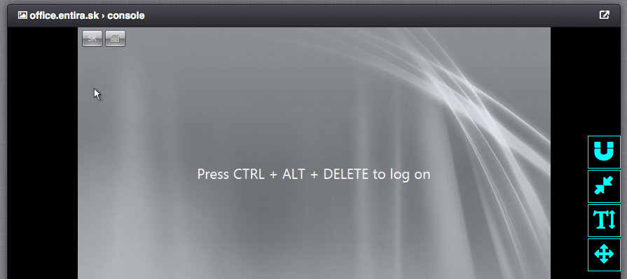

Virtual Server Console
######################

=============================== ================
:ref:`Access Permissions <acl>`
------------------------------- ----------------
*SuperAdmin*                    read-write
*DCAdmin*                       read-write
*VmOwner*                       read-write
=============================== ================

.. note:: The console view is currently available only for KVM virtual servers.

Console Usage
=============

Please use the *Magnet Icon* to attach your keyboard and mouse to the virtual server console.

* **Magnet Icon** - Capture and send keystrokes and mouse events into the virtual server.
* **Resize Icon** - Zoom in or zoom out the console view to make use of the whole console screen area.
* **Text Icon** - Show or hide the on-screen keyboard, which enables typing on devices without a hardware keyboard.
* **Move Icon** - Move the on-screen icon menu to another position on the console screen.

.. note:: The icon in the upper right corner of the console header can be used to open the console screen in a new window.

.. note:: The CTRL + ALT + DELETE shortcut can be triggered by holding the *Fn* key on the on-screen or hardware keyboard.
