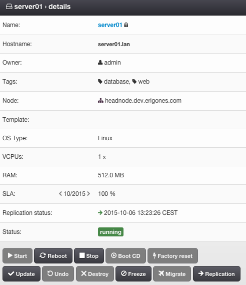
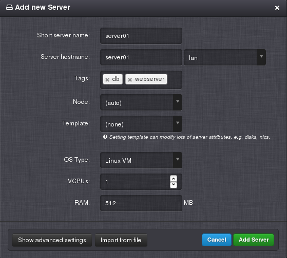
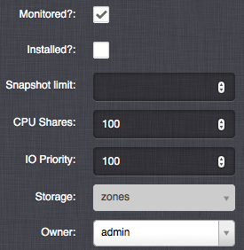
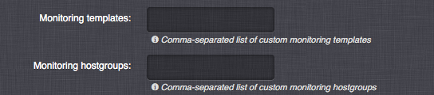
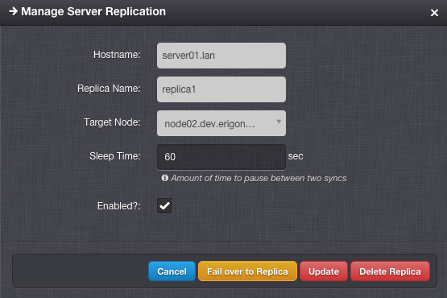
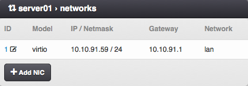
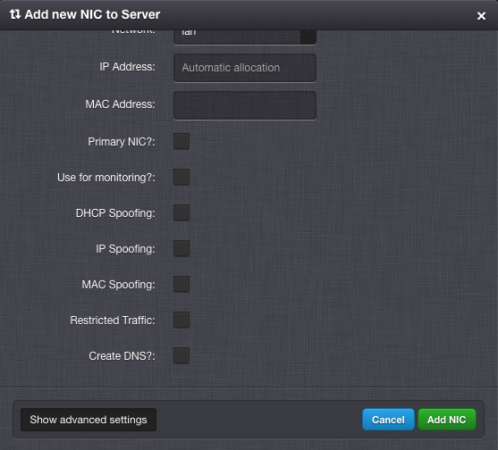
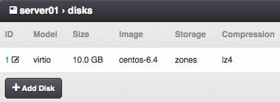
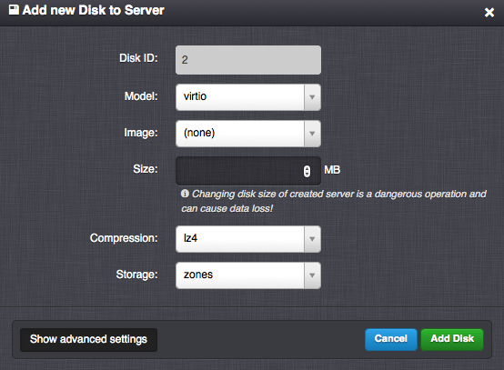

.. _vm:
.. _server:

Virtual Server Details
######################

A Virtual Server is either a KVM virtual machine or a Solaris/Linux zone.

=============================== ================
:ref:`Access Permissions <acl>`
------------------------------- ----------------
*SuperAdmin*                    read-write
*DCAdmin*                       read-write
*VmOwner*                       read-write
=============================== ================

Virtual Server Parameters
=========================

* **Name** - Short virtual server name.
* **Hostname** - Unique virtual server identifier.
* **Owner** - Owner of the virtual server.
* **Tags** - List of user-defined tags.
* **Node** - The compute node the virtual server is or is going to be deployed to.
* **Template** - Template. 
* **OS Type** - Operating system type. One of:

    * *Linux VM*
    * *Windows VM*
    * *BSD VM*
    * *SunOS VM*
    * *SunOS Zone*
    * *Linux Zone*
* **vCPUs** - Number of virtual CPUs assigned to the virtual server.
* **RAM** - The amount of RAM (MB) assigned to the virtual server.
* **SLA** - Monthly SLA (read-only). Can be enabled/disabled via :ref:`monitoring DC settings <dc_monitoring_settings>`.
* **Replication status** - Replication status (enabled/disabled) and time of last successful sync (*Danube Cloud Enterprise Edition*).
* **Status** - One of:

    * *running*
    * *stopped*
    * *stopping*
    * *notready* - the virtual server cannot be used, because of some ongoing internal operation
    * *deploying* - the virtual server is being installed onto the compute node
    * *frozen* - stopped and cannot be managed.
    * *notcreated* - defined only in the DB
    * *error* - unknown status

    .. note:: A ``-`` (minus) character appended to the status name means that the virtual server status is currently changing.

* **Note** - User editable text with `markdown <https://daringfireball.net/projects/markdown/syntax>`_ support, visible to every user with access to this server.

.. _create_server:
.. _vm-add:
.. _vm-manage:

Managing a Virtual Server
=========================

A virtual server can be created, updated and deleted by a *SuperAdmin* or *DCAdmin*. A *VMOwner* can modify only a limited number of settings of an existing virtual server.

.. note:: When a virtual server has a lock icon appended to its name it means that the virtual server is locked because it has existing replicas and it is not possible to change its parameters.

Advanced Virtual Server Settings
--------------------------------

Besides managing the above-mentioned basic :ref:`virtual server parameters <vm>`, it is possible to change some advanced virtual server settings.

* **Monitored** - Enable virtual server synchronization with the monitoring system.
* **Installed** - Mark the virtual server as installed. Will always be enabled when a disk image is used.
* **Snapshot count limit** - Maximum number of manual snapshots for this virtual server.
* **Snapshot size limit** - Maximum size (MB) of all snapshots for this virtual server.
* **CPU Shares** - The virtual server's CPU shares value, relative to other servers. A higher value indicates a higher priority for allocation of CPU time. The default value for all virtual servers is 100, unless changed in the :ref:`virtual server DC settings <dc_vm_settings>`.
* **IO Priority** - The virtual server's IO throttling priority, relative to other servers. A higher value indicates a higher priority for allocation of IO resources. The default value for all virtual servers is 100, unless changed in the :ref:`virtual server DC settings <dc_vm_settings>`.
* **Storage** - A :ref:`node storage <node_storages>` used for storing the zone configuration for a KVM virtual server. This will also be the name of the default node storage when adding new disks to this virtual server.

    .. warning:: It is possible to store virtual server's disks on different node storages which means that the virtual server's data will be stored on differed physical data storages. This may significantly affect the availability level of the virtual server.

* **Monitoring templates** - List of existing Zabbix templates, which will be assigned to this virtual server in the monitoring system.
* **Monitoring hostgroups** - List of existing Zabbix host groups, which will be used for this virtual server in the monitoring system.
* **Metadata** - Customer metadata accessible from within the virtual server. Key=value string pairs (32 max), where keys can 128 characters long and values 65536 characters long.

    .. seealso:: More information about virtual server's metadata can be found in a :ref:`separate chapter <metadata>`.

Virtual Server Actions
======================

* **Deploy** - Create and install the virtual server on compute node. The virtual server must be in a *notcreated* state. In case, the virtual server does not have a compute node set a compute node will be chosen and assigned automatically to the virtual server before the actual deploy operations starts.
* **Start** - Start the virtual server on the compute node. The virtual server must be in a *stopped* state.
* **Reboot** - Reboot the virtual server. The virtual server must be in a *running* state. A subsequent modal window with following options will pop up:

    * *Reboot* - Send an ACPI reboot signal to the virtual server.
    * *Force Reboot* - Immediately reboot the virtual server.
* **Stop** - Stop the virtual server. The virtual server must be in a *running* or *stopping* state. A subsequent modal window with following options will pop up:

    * Shutdown - Send an ACPI shutdown signal to the virtual server.
    * Force shutdown - Immediately shut down the virtual server.

    .. warning:: The ACPI restart and shutdown actions require the virtual server to have a functional ACPI daemon running.

    .. warning:: Unless a KVM virtual server is not stopped or rebooted within the time period specified by the :ref:`VMS_VM_STOP_TIMEOUT_DEFAULT <dc_vm_settings>` setting (3 minutes by default), the virtual server will be automatically shut down or rebooted by using the *force* method.
* **Migrate** - Migrate the virtual server into an another compute node.

    .. image:: img/vm_migrate.png

    .. note:: It is possible to perform the migration only between node storages (zpools) with the same name. Migration between node storages with different names can be performed via the :ref:`API <api>`.
* **Replication** - :ref:`Create or manage replicas of this virtual server <vm_replication>`. The virtual server must be in a *running* or *stopped* state (*Danube Cloud Enterprise Edition*).
* **Boot CD** - Start the virtual server from an ISO image (KVM only). The virtual server must be in a *stopped* state. For instructions on how to add/manage ISO images see :ref:`Managing an ISO Image <managing_iso_image>`.

    .. image:: img/vm_boot_cd.png
* **Factory reset** - Destroy and recreate the virtual server on compute node. The virtual server must be in a *stopped* state.
* **Update** - Push the current configuration changes of the virtual server onto the compute node. The virtual server must be in a *running* or *stopped* state. Some updates (i.e. adding or removing virtual server disks and NICs) will take effect only after stopping and starting the virtual server. 
* **Undo** - Restore configuration of the virtual server to a state that is identical with the state on the compute node.
* **Destroy** - Remove the virtual server and all server data from the compute nodes. The virtual server must be in a *stopped* state.
* **Delete** - Remove the definitions of the virtual server from the DB. The virtual server must be in a *notcreated* state.
* **Freeze** - Stop and disable management of the virtual server. The virtual server must be in a *running* or *stopped* state.
* **Unfreeze** - Enable management of the virtual server. The virtual server must be in a *frozen* state.

.. note:: Availability of virtual server actions depends on the :ref:`user's role <roles>`.

.. note:: The *Danube Cloud* GUI interface may require multiple confirmations for some potentially dangerous actions that can lead to data loss.

    .. image:: img/vm_warning.png

.. _vm_replication:

Virtual Server Replication
--------------------------

.. note:: This section describes functionality available only in the *Danube Cloud Enterprise Edition*.

Replication is a process by which all disks of a virtual server are periodically sent to another remote compute node. Replication allows for having two nearly identical copies of a virtual server in two different locations and dramatically increases the availability of services provided by the virtual server.

.. note:: The virtual server replica takes up the same amount of virtual data center/compute node resources as the master server.

.. note:: It is possible to setup replication only between node storages (zpools) with the same name. Replication between node storages with different names can be setup via the :ref:`API <api>`.

Replication Settings
~~~~~~~~~~~~~~~~~~~~

* **Hostname** - Hostname of the master virtual server (read-only).
* **Replica Name** - Name of the replication configuration.
* **Target Node** - Destination compute node.
* **Sleep Time** - Number of seconds to pause between two replication operations.
* **Enabled** - Whether the replication is enabled.
* **Reserve Resources** - Whether to reserve the virtual machine's vCPU and RAM resources on target compute node. The default is to reserve the virtual server's resources unless changed in the :ref:`virtual server DC settings <dc_vm_settings>`. Since the replicated virtual server is not running on the target node, the resources are not immediately needed by the slave virtual server. When disabled, vCPU and RAM resources are not subtracted from available compute node resources and can be used for other virtual servers.

    .. note::  When disabled, the resources must be available (and will be reserved) before the failover action. The user is responsible for ensuring that enough resources are available for the failver operation.

Replication Actions
~~~~~~~~~~~~~~~~~~~

* **Create Replica** - Create the replica and replication service on the target compute node and perform an initial sync.
* **Update** - Update replication service parameters on the target compute node.
* **Delete Replica** - Destroy the replica and replication service on the target compute node.
* **Fail over to Replica** - The server replica will be promoted to master virtual server and current master virtual server will be stopped.
* **Reinitialize Replica** - Degrade old master virtual server to replica and reinitialize replication after successful failover.

.. _vm_nics:

Virtual Server NICs
===================

Virtual Server NIC Parameters
-----------------------------

* **ID** - Network interface card ID (read-only).
* **Model** - NIC driver (KVM only). One of: *virtio*, *e1000*, *rtl8139*.

    .. note:: It is recommended to use the *virtio* driver, which provides the highest performance and reduces consumption of CPU time. Some operating systems require additional installation of the *virtio* driver.
* **Network** - Name of the :ref:`virtual network <networks>`.
* **IP Address** - Virtual NIC IPv4 address. Must be part of the network.
* **Gateway** - IPv4 gateway (read-only, inherited from network).
* **MAC Address** - Will be generated automatically.
* **Primary NIC?** - Whether to use this NICs gateway as the default gateway of this virtual server.
* **Use for monitoring?** - Whether to use this NICs IP address for external monitoring.
* **DHCP Spoofing** - Allow packets required for DHCP server (requires *SuperAdmin* privileges).
* **IP Spoofing** - Allow sending and receiving packets for IP addresses other than the assigned *IP Address* (requires *SuperAdmin* privileges).
* **MAC Spoofing** - Allow sending packets with MAC addresses other than specified the assigned *MAC Address* (requires *SuperAdmin* privileges).
* **Restricted Traffic** - Allow sending packets that are not IPv4, IPv6, or ARP (requires *SuperAdmin* privileges).
* **Create DNS** - Create a DNS A record for virtual server's hostname?

.. warning:: Enabling one of *DHCP Spoofing*, *IP Spoofing*, *MAC Spoofing* or *Restricted Traffic* may seriously jeopardize network security of the data center.

Managing a Virtual Server NIC
-----------------------------

.. _disk_image_add:

Virtual Server Disks
====================

Virtual Server Disk Parameters
------------------------------

* **Disk ID** - Virtual disk ID. The first disk is usually used for installing the operating system.
* **Model** - Disk driver (KVM only). One of: *virtio*, *ide*, *scsi*.

    .. note:: It is recommended to use the *virtio* driver, which provides the highest performance and reduces consumption of CPU time. Some operating systems require additional installation of the *virtio* driver.
* **Size** - Disk size in MB.

    .. note:: It is possible to append units (e.g. ``g`` or ``G``) after the number. A JavaScript function will immediately change the value into an appropriate number in MB (e.g. ``20g`` will be changed to ``20480``).
* **Image** - :ref:`Disk image <images>` (required for non KVM servers).
* **Storage** - The :ref:`node storage <node_storages>` used for creating the virtual disk.
* **Bootable** - Whether this disk should be bootable (KVM only).
* **Compression** - Disk compression algorithm. One of: *off*, *lzjb*, *gzip-[1-9]*, *zle*, *lz4*.

    .. note:: The recommended compression type is LZ4.

    .. note:: The compression algorithm can be changed at any time. A new type of compression is used only for newly written data.

    .. note:: Compression can utilize unused CPU time to increase the speed of reading and writing data, while saving disc space.

Managing a Virtual Server Disk
------------------------------

.. warning:: Resizing a virtual disk may result in data loss. The disk size changing procedure depends on the operating system. The virtual server must always be backed up before changing the disk size!

