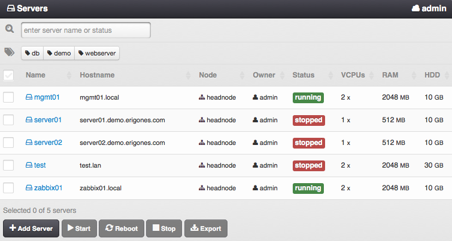
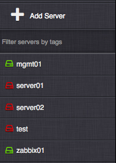

.. _server-list:

Virtual Server List
###################

List of all virtual servers defined in the currently active :ref:`virtual data center <dcs>`. The virtual servers can be filtered by the name, hostname, status or tags.

=============================== ================
:ref:`Access Permissions <acl>`
------------------------------- ----------------
*SuperAdmin*                    read-write
*DCAdmin*                       read-write
*VmOwner*                       read-write
=============================== ================

.. note:: Virtual servers, which have similar uses or attributes can be tagged with specific names, e.g. web server, database, sql, Linux. The tags can be used to filter and run tasks for whole groups of servers.

The secondary menu provides quick access to virtual servers defined in the currently active :ref:`virtual data center <dcs>`. This list can be filtered by virtual server tags.

Virtual Server List Item Parameters
===================================

* **Name** - Short virtual server name.
* **Hostname** - Unique virtual server identifier.
* **Node** - The compute node the virtual server is or is going to be deployed to.
* **Owner** - Owner of the virtual server.
* **Status** - One of:

    * *running*
    * *stopped*
    * *stopping*
    * *notready* - the virtual server cannot be used, because of some ongoing internal operation
    * *deploying* - the virtual server is being installed onto the compute node
    * *frozen* - stopped and cannot be managed.
    * *notcreated* - defined only in the DB
    * *error* - unknown status

    .. note:: A ``-`` (minus) character appended to the status name means that the virtual server status is currently changing.

* **vCPUs** - Number of virtual CPUs assigned to the virtual server.
* **RAM** - The amount of RAM (MB) assigned to the virtual server.
* **HDD** - Cumulative disk size (GB) assigned to the virtual server.

.. _vms_actions:

Virtual Server Actions
======================

* **Add Server** - Link to the :ref:`add virtual server view <vm-add>`.
* **Deploy** - Create and install selected virtual servers on compute node(s). The selected servers must be in a *notcreated* state.
* **Start** - Start the selected virtual servers. The selected servers must be in a *stopped* state.
* **Reboot** - Reboot the selected virtual servers. The selected servers must be in a *running* state. A subsequent modal window with following options will pop up:

    * *Reboot* - Send an ACPI reboot signal to the selected virtual servers.
    * *Force Reboot* - Immediately reboot the selected virtual servers.
* **Stop** - Stop the selected virtual servers. The selected servers must be in a *running* or *stopping* state. A subsequent modal window with following options will pop up:

    * Shutdown - Send an ACPI shutdown signal to the selected virtual servers.
    * Force shutdown - Immediately shut down the selected virtual servers.

    .. warning:: The ACPI restart and shutdown actions require the virtual server(s) to have a functional ACPI daemon running.

    .. warning:: Unless a KVM virtual server is not stopped or rebooted within the time period specified by the :ref:`VMS_VM_STOP_TIMEOUT_DEFAULT <dc_vm_settings>` setting (3 minutes by default), the virtual server will be automatically shut down or rebooted by using the *force* method.

* **Update** - Push the current configuration changes of selected virtual servers onto their respective compute nodes. The selected servers must be in a *running* or *stopped* state. Some updates (i.e. adding or removing virtual server disks and NICs) will take effect only after stopping and starting the affected virtual servers.
* **Undo** - Restore configuration of selected servers to a state that is identical with the state on the compute node.
* **Export** - Export the selected virtual servers to an Excel sheet.
* **Destroy** - Remove the selected virtual servers and all server data from their respective compute nodes. The selected servers must be in a *stopped* state.
* **Delete** - Remove the definitions of selected virtual servers from the DB. The selected servers must be in a *notcreated* state.
* **Freeze** - Stop and disable management of selected virtual servers. The selected servers must be in a *running* or *stopped* state.
* **Unfreeze** - Enable management of selected virtual servers. The selected servers must be in a *frozen* state.

.. note:: When a virtual server has a lock icon appended to its name it means that the virtual server is locked because it has existing replicas and it is not possible to change its parameters.

.. note:: Availability of virtual server actions depends on the :ref:`user's role <roles>`.

.. note:: The *Danube Cloud* GUI interface may require multiple confirmations for some potentially dangerous actions that can lead to data loss.

    .. image:: img/vm_warning.png

