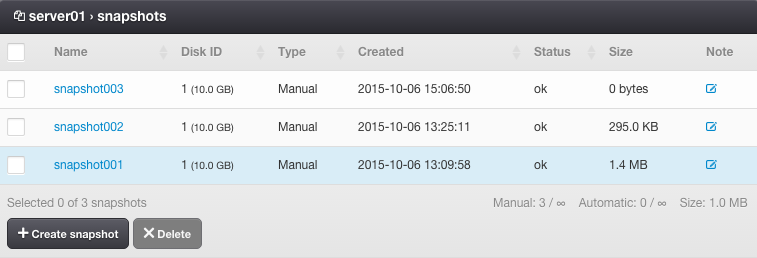
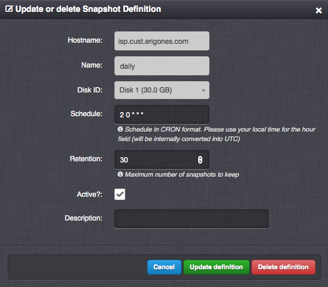
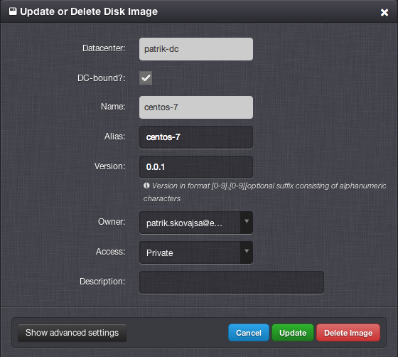

.. _vm_snapshots:
.. _snapshot:

Virtual Server Snapshots
########################

A Snapshot is a local backup of a virtual server disk. A snapshot does not take up any disk capacity at the time of creation. The disk capacity is consumed only by changes performed on the disk after the snapshot's creation.

=============================== ================
:ref:`Access Permissions <acl>`
------------------------------- ----------------
*SuperAdmin*                    read-write
*DCAdmin*                       read-write
*VmOwner*                       read-write
=============================== ================

.. note:: Creating a snapshot and performing a rollback are instant operations. It is recommended to create a snapshot before performing any non-trivial action inside the virtual server.

.. warning:: Snapshots are stored on the same node storage as virtual server disks used for the snapshots. Failure of a node storage, therefore, results in loss of snapshots.

Snapshot Parameters
===================

* **Name** - Snapshot name (read-only).
* **Disk ID** - Virtual server disk ID (read-only).
* **Type** - Snapshot type (read-only). One of:

    * *Manual*
    * *Automatic*
* **Created** - The date and time when the snapshot was created (read-only).
* **Status** - Snapshot state (read-only). One of:

    * *ok*
    * *pending*
    * *rollback*
    * *lost*
* **Size** - The approximate size of the snapshot (read-only).
* **Note**

.. note:: The snapshot *size* parameter is automatically updated once every hour.

.. note:: Snapshots created with the *Freeze filesystem* option enabled are marked with a flag icon appended to their *status*.

Advanced Snapshot Parameters
----------------------------

* **Freeze filesystem?** - Whether to create an application-consistent snapshot (KVM only). Requires QEMU Guest Agent to be running inside the virtual server.

Snapshot Actions
================

* **Create snapshot** - Immediately create a snapshot from one or all virtual server's disks.

    .. image:: img/vm_create_snapshot.png

* **Delete snapshot** - Remove data of the snapshot.

    .. image:: img/vm_manage_snapshot.png

* **Rollback snapshot** - Restore server disk data from the snapshot.

    .. warning:: A snapshot rollback will lead to deletion of all data including every newer snapshot created after the restored snapshot.

    .. note:: It is also possible to restore a snapshot into another virtual server. This functionality is currently available only in the :ref:`API <api>` (``PUT /vm/(hostname_or_uuid)/snapshot/(snapname)``) . 
  

.. _snapshot_definition:

Snapshot Definitions
====================

A Snapshot Definition is a configuration based on which periodic snapshots are automatically created and deleted.

.. image:: img/vm_snapshot_definition.png

=============================== ================
:ref:`Access Permissions <acl>`
------------------------------- ----------------
*SuperAdmin*                    read-write
*DCAdmin*                       read-write
*VmOwner*                       read-only
=============================== ================

Snapshot Definition Parameters
------------------------------

* **Name** - Snapshot definition name.
* **Disk ID** - Virtual server disk ID.
* **Schedule** - Automatic scheduler configuration in Cron format. Use your local time for the hour field (it will be internally converted into UTC).
* **Retention** - Maximum number of snapshots to keep. After exceeding this number of snapshots, the oldest snapshot associated with the snapshot definition will be automatically removed.
* **Active** - Whether the snapshot definition is active.
* **Description**

Advanced Snapshot Definition Parameters
~~~~~~~~~~~~~~~~~~~~~~~~~~~~~~~~~~~~~~~

* **Freeze filesystem?** - Whether to create application-consistent snapshots (KVM only). Requires QEMU Guest Agent to be running inside the virtual server.

Cron Format
~~~~~~~~~~~

.. include:: cron_format.rst

.. _image_create:

Creating an Image From a Snapshot
=================================

* **Name** - Unique image identifier (usually used in the :ref:`API <api>`).
* **Alias** - A user-defined name of an image (usually displayed in the :ref:`GUI <gui>`).
* **Version** - Image version.
* **Access** - Image visibility. One of:

    * *Public* - Image is usable by all users in this virtual data center.
    * *Private* - Image is usable by *SuperAdmins* and owners of this image.
    * *Deleted* - Image is hidden and unusable for new servers, but can be still used by some already defined servers.
* **Owner** - Image owner.
* **Tags** - Comma-separated list of image tags, which will be inherited by virtual servers that will use this image.
* **Resizable? (Resize)** - Specifies whether an image is able to resize a virtual disk during an initial start or deploy procedure. This is usually achieved by a post-installation script that has to be included in the disk image.
* **Shutdown after deploy? (Deploy)** - Specifies whether an image is able to shut down a virtual server after an initial start. Such an image should include a post-installation script, which will shut down the running operating system after it has been successfully configured. After a virtual server is stopped, it is considered to be successfully deployed, and it will be automatically started by the system.
* **Description**

.. seealso:: More information about disk images can be found in a :ref:`separate chapter <images>`.

