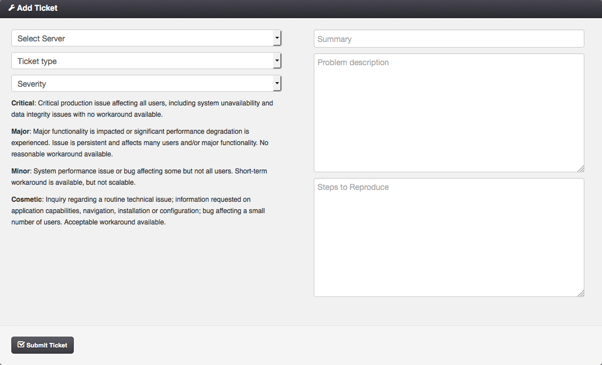

.. _add_ticket:

Add Ticket
##########

With the *Support* module enabled, every user can submit a support ticket in case of a problem. The ticket is sent as a plain text email to the email address set in the :ref:`SUPPORT_EMAIL setting <dc_settings>`. The user who submits the ticket may receive a confirmation email depending on the :ref:`SUPPORT_USER_CONFIRMATION setting <dc_settings>`.

=============================== ================
:ref:`Access Permissions <acl>`
------------------------------- ----------------
*User*                          read-write
=============================== ================

.. note:: The Support module can be disabled via the :ref:`virtual data center settings <dc_modules>` page.
