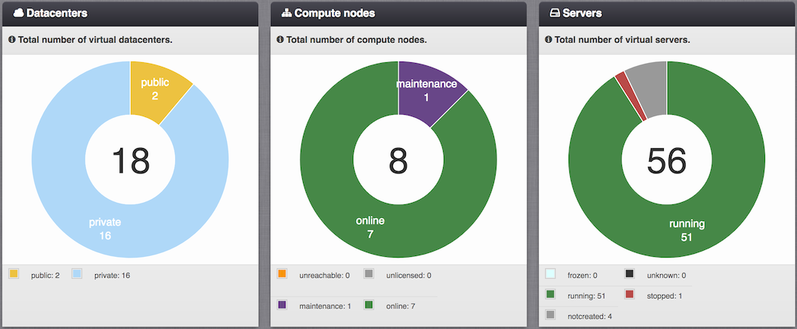
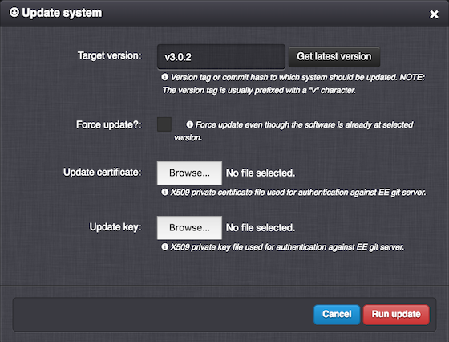

.. _system:

System
******

The System menu is available only to :ref:`SuperAdmin <roles>` users and offers information and functionality related to the *Danube Cloud* system itself.

.. note:: The System menu is available only in Danube Cloud version 3.0 or newer.

=============================== ================
:ref:`Access Permissions <acl>`
------------------------------- ----------------
*SuperAdmin*                    read-write
=============================== ================

.. contents:: Table of Contents

----

Overview
########

Statistics about :ref:`virtual data centers<dcs>`, :ref:`compute nodes<nodes>` and :ref:`virtual servers<vms>`.

----

Configuration
#############

*Danube Cloud* system is configured via :ref:`virtual data center settings<dc_settings>`. 

----

.. _system_maintenance:

Maintenance
###########

System Update
=============

The system maintenance view can be used for updating the *Danube Cloud* software on the :ref:`mgmt01 virtual server<admin_dc>` and compute nodes. Please refer to the :ref:`maintenance section of this user guide<update_esdc>` for more information on updating *Danube Cloud*.

.. note:: When updating *Danube Cloud*, the software on the :ref:`management server<admin_dc>` must be updated first.

.. note:: Please, always read the release notes before performing an update: https://github.com/erigones/esdc-ce/wiki/Release-Notes

----
