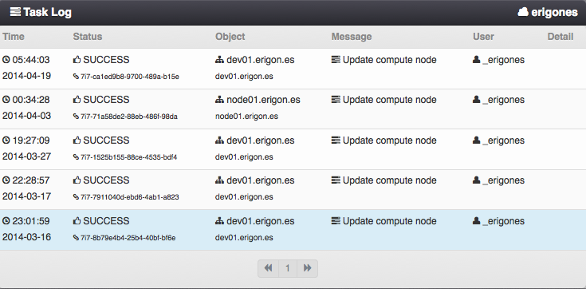
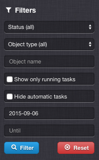

.. _tasklog:

Task Log
********

The Task Log view displays records of individual events that took place in a :ref:`virtual data center <datacenters>`.

.. note:: Tasks, which are not bound to a specific virtual data center (e.g. compute node related tasks) are always stored in the task log of the default *main* virtual data center.

=============================== ================
:ref:`Access Permissions <acl>`
------------------------------- ----------------
*User*                          read-only
=============================== ================

Task Log Parameters
###################

* **Time** - Date and time of an event.
* **Status** - Task status. One of:

    * *SUCCESS*
    * *FAILURE*
    * *PENDING*
    * *REVOKED*

* **Object** - An object affected by the event. The column displays the object's user-defined name (usually the *alias* attribute), as well as object's unique identifier (usually the *name* or *hostname* attribute).
* **Message** - :ref:`A qualified name of the event <tasklog_messages>`.
* **User** - An actual user who initiated the event.
* **Detail** - Task details, e.g. :ref:`API <api>` function parameters, return values, detailed status messages, etc.

Task Log Filters
################

* **Status** - Task status. One of:

    * *SUCCESS*
    * *FAILURE*
    * *PENDING*
    * *REVOKED*

* **Object type** - One of:

    * *All*
    * :ref:`Datacenter <dcs>`
    * :ref:`VM <vms>`
    * :ref:`Node <nodes>`
    * :ref:`Storage <node_storages>`
    * :ref:`Network <networks>`
    * :ref:`Image <images>`
    * :ref:`Template <templates>`
    * :ref:`ISO image <iso_images>`
    * :ref:`Domain <dns>`
    * :ref:`User <users>`
    * :ref:`User Group <groups>`

* **Show only running tasks** - Hide entries of tasks that have already finished.

* **Hide automatic tasks** - Hide entries of tasks that have been run automatically (e.g. automatic snapshots and backups).

* **Date & Time** - Limit output to task records created during specific period of time (*since* - *until*).

.. _tasklog_messages:

Task Log Messages
#################

* :ref:`Virtual machines <vms>`

    * **Virtual server definition**

        * *Create server definition*
        * *Update server definition*
        * *Delete server definition*
        * *Revert server definition*
        * *Create server disk definition*
        * *Update server disk definition*
        * *Delete server disk definition*
        * *Create server NIC definition*
        * *Update server NIC definition*
        * *Delete server NIC definition*

    * **Basic server operations**

        * *Create server*
        * *Delete server*
        * *Update server*
        * *Recreate server*
        * *Status of server changed*
        * *Current status of server*
        * *Start server*
        * *Update and start server*
        * *Start server from CD image*
        * *Update and start server from CD image*
        * *Reboot server*
        * *Force server reboot*
        * *Update and reboot server*
        * *Update and force server reboot*
        * *Stop server*
        * *Force server stop*
        * *Update and stop server*
        * *Update and force server stop*

    * **Snapshots and Backups**

        * *Create server snapshot definition*
        * *Update server snapshot definition*
        * *Delete server snapshot definition*
        * *Create server backup definition*
        * *Update server backup definition*
        * *Delete server backup definition*
        * *Create backup of server's disk*
        * *Create snapshot of server's disk*
        * *Delete snapshots of server's disk*
        * *Rollback snapshot of server's disk*
        * *Delete snapshot of server's disk*
        * *Restore backup of server's disk*
        * *Delete backup of server's disk*
        * *Delete backups of server's disk*
        * *Synchronize snapshots of server's disk*

    * **Migration and Replication**

        * *Migrate server*
        * *Migrate server to datacenter*
        * *Create server replica*
        * *Update server replica*
        * *Delete server replica*
        * *Failover to server replica*
        * *Reinitialize server replica*

    * **Monitoring**

        * *Update server monitoring definition*
        * *Sync server monitoring host*
        * *Delete server monitoring host*

* :ref:`Compute Nodes <nodes>`

    * *Update node status*
    * *Create compute node*
    * *Update compute node*
    * *Update node definition*
    * *Delete node definition*
    * *Import image on node storage*
    * *Remove image from node storage*
    * *Create node storage*
    * *Update node storage*
    * *Delete node storage*
    * *Harvest servers*
    * *Synchronize server snapshots on node storage*
    * *Sync compute node monitoring host*
    * *Delete compute node monitoring host*

* :ref:`Virtual Data Centers <datacenters>`

    * *Create datacenter*
    * *Update datacenter*
    * *Update datacenter settings*
    * *Add compute node to datacenter*
    * *Update compute node in datacenter*
    * *Remove compute node from datacenter*
    * *Add node storage to datacenter*
    * *Remove node storage from datacenter*
    * *Add network to datacenter*
    * *Remove network from datacenter*
    * *Add server image to datacenter*
    * *Remove server image from datacenter*
    * *Add server template to datacenter*
    * *Remove server template from datacenter*
    * *Add ISO image to datacenter*
    * *Remove ISO image from datacenter*
    * *Add DNS domain to datacenter*
    * *Remove DNS domain from datacenter*
    * *Add user group to datacenter*
    * *Remove user group from datacenter*

* :ref:`Networks <networks>`

    * *Create network*
    * *Update network*
    * *Delete network*
    * *Create IP address*
    * *Update IP address*
    * *Delete IP address*
    * *Create IP addresses*
    * *Delete IP addresses*

* :ref:`Disk Images <images>`

    * *Create image*
    * *Import image*
    * *Update image*
    * *Delete image*
    * *Refresh image repository*

* :ref:`Templates <templates>`

    * *Create server template*
    * *Update server template*
    * *Delete server template*

* :ref:`ISO Images <iso_images>`

    * *Create ISO image*
    * *Update ISO image*
    * *Delete ISO image*

* :ref:`DNS Domain and Records <dns>`

    * *Create DNS domain*
    * *Update DNS domain*
    * *Delete DNS domain*
    * *Create DNS record*
    * *Update DNS record*
    * *Delete DNS record*
    * *Delete DNS records*

* :ref:`Users <users>` and :ref:`User Groups <groups>`

    * *Create user*
    * *Update user*
    * *Delete user*
    * *Update user profile*
    * *Create user group*
    * *Update user group*
    * *Delete user group*
    * *Add user SSH key*
    * *Delete user SSH key*

* :ref:`System <system>`

    * *System Update*
    * *Update system settings*

* :ref:`Monitoring <monitoring>`

    * *Create monitoring user*
    * *Update monitoring user*
    * *Delete monitoring user*
    * *Create monitoring usergroup*
    * *Update monitoring usergroup*
    * *Delete monitoring usergroup*
    * *Create monitoring hostgroup*
    * *Update monitoring hostgroup*
    * *Delete monitoring hostgroup*
    * *Create monitoring action*
    * *Update monitoring action*
    * *Delete monitoring action*
