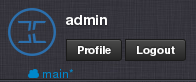

Top Menu
********

From top menu you can manage your :ref:`user profile <user_profile>`, :ref:`switch data centers<switch_dc>` or :ref:`log out<logout>` of the *Danube Cloud*.

.. _user_profile:

User Profile
############

* **User Profile**

    .. image:: img/user_profile.png

* **User Settings**

    .. image:: img/user_settings.png

* **Address**

    .. image:: img/address.png

* **Change password form**

    .. image:: img/change_password_form.png

* **SSH Keys** - Public SSH keys, which will be automatically added to newly created virtual servers using disk images with support for import of SSH keys.

    .. image:: img/ssh_keys.png

* **API Keys** - An *API key* can be used to connect the *Danube Cloud* API without using a username and password. A *callback key* is part of a security mechanism for checking authenticity of callback requests.

    .. image:: img/api_keys.png

    .. seealso:: Detailed information about API and Callback Keys can be found in the :ref:`API documentation <API>`.

.. _switch_dc:

Data Center Switching
#####################

The data center switch is used for changing the current working virtual data center.

    .. image:: img/dc_switch.png

.. seealso:: More information about virtual data centers can be found in the :ref:`Virtual Data Centers section <datacenters>`.

.. _logout:

Logout
######

Safely log out of the *Danube Cloud* Web Management Console.
