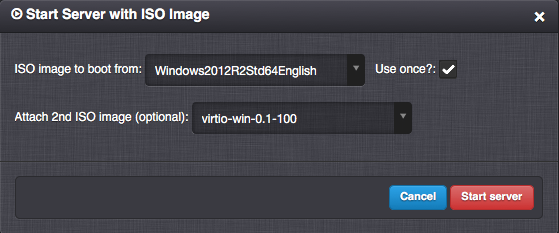
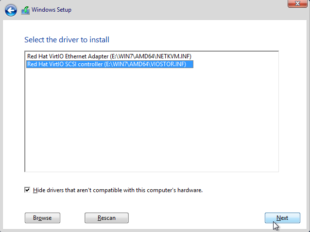
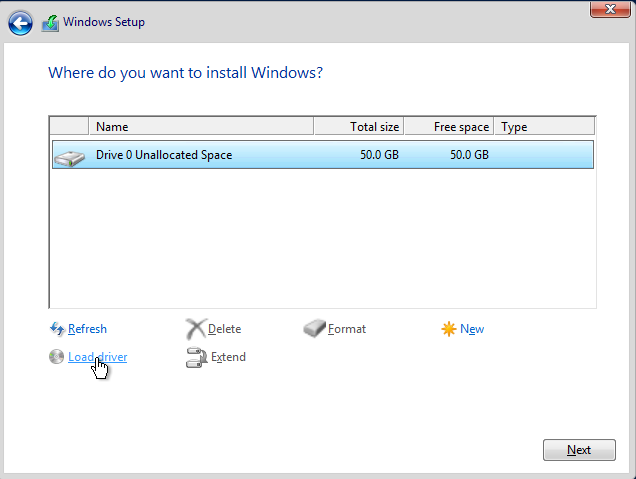

Creating a Virtual Server with Microsoft Windows Server 2012 R2
***************************************************************

Creating a Virtual Server
#########################

* Create a :ref:`virtual server <vm>` definition.

    .. image:: img/windows_add_server.png

* Virtual server details.

    .. image:: img/windows_server_details.png

* Adding a virtual disk with VIRTIO driver.

    .. note:: It is possible to increase the disk capacity additionally. The increase will take effect after restarting the server and extending the disk size in the operating system.

    .. image:: img/windows_server_disk.png

* Adding a virtual NIC with VIRTIO driver.

    .. image:: img/windows_server_nt.png

* Deploy the virtual server.

.. _cdimage2:

Starting the Virtual Server
###########################

The performance of the Microsoft Windows Server operating system can be optimized by using VIRTIO drivers for both disks and NICs. The VIRTIO drivers are not supported by the OS installer and need to be loaded during the installation by using a secondary CD-ROM ISO image.

Installing the Operating System
###############################

Loading the disk and NIC VIRTIO drivers from the secondary CD-ROM drive (``E:\WIN7\AMD64\``) into the OS installer.

You can download the latest VIRTIO drivers here:
    https://fedorapeople.org/groups/virt/virtio-win/direct-downloads/latest-virtio/virtio-win.iso

Driver locations on the iso image:

    * Hard disk: ``viostor\<win_version>\amd64``
    * Ethernet Adapter: ``NetKVM\<win_version>\amd64``

You can click :guilabel:`Load driver` multiple times and add also the driver for the ethernet adapter during this Windows install phase.

.. seealso:: For instructions on how to add/manage ISO images see :ref:`Managing an ISO Image <managing_iso_image>`.

Configuring VM Shutdown from Danube Cloud
#########################################

The following settings are necessary to properly shut down the Windows operating system through *Danube Cloud*. Improper shutdown can cause damage to the file system when the virtual server is manually shut down or migrated via *Danube Cloud*.

* Allowing shutdown without login.

    Run the *Group Policy Object Editor* tool (for example run via :guilabel:`Run (WIN+R) -> gpedit.msc`) and navigate to :guilabel:`Computer Configuration -> Windows Settings -> Security Settings -> Local Policies -> Security Options`, where the ``Shutdown`` property must be set to ``Allow system to be shut down without having to log on``.

* Enabling immediate shutdown of a virtual server with logged in users.

    Run the *regedit* tool (for example run via :guilabel:`Run (WIN+R) -> regedit`) and navigate to :guilabel:`HKEY_LOCAL_MACHINE -> SOFTWARE -> Microsoft -> Windows NT -> CurrentVersion -> Windows` where the ``ShutdownWarningDialogTimeout`` property must be changed to ``dword:00000001``.
   

Zabbix Agent Installation
#########################

* Download the Zabbix Agent installer from http://www.suiviperf.com/zabbix/ (recommended) or directly from the official web page http://www.zabbix.com.
* Run the installer and go through the configuration wizard, which is part of the installer. The most important setting is *Server* where the hostname or IP address of the Zabbix server must be put in.
* Add a firewall rule to open the Zabbix Agent port **10050**.
* The Zabbix Agent can be tested by attaching a Zabbix template *Template OS Windows* to the :ref:`virtual server <vm>` via *Danube Cloud* :guilabel:`Change Server Settings -> Show advanced settings -> Monitoring templates`. The template must be allowed for use in the current :ref:`virtual data center <dcs>` (:guilabel:`Datacenter -> Settings -> MON_ZABBIX_TEMPLATES_VM_ALLOWED`).
* Log in into the Zabbix web frontend and check :guilabel:`Configuration -> Hosts -> Name -> Availability`. The virtual server's Zabbix agent must be connected to the Zabbix server, which is indicated by a green :guilabel:`Z` icon.

QEMU Guest Agent Installation
#############################

The QEMU Guest Agent is a service running inside the guest operating system and waiting for commands from the *Danube Cloud* system.

Before creating a snapshot with *Freeze filesystem* attribute enabled, a "file system freeze" command is sent to the QEMU Guest Agent, which leads to the creation of a consistent snapshot by calling the Volume Shadow Copy Service (VSS).

.. note:: Please make sure that the affected application software supports VSS.

* Enable Windows Remote Management (WinRM).

    .. image:: img/remote_management.png

* Add permissions for running VSS by the qemu-agent service.

    .. image:: img/dcomcnfg.png

    Open :guilabel:`Component Services -> Computers -> My Computer`, right-click on :guilabel:`My Computer` and open :guilabel:`Properties`. Continue to :guilabel:`COM Security -> Access Permission -> Edit Default`, add a :guilabel:`Network Service` system account a set :guilabel:`Local Access` to ``allowed``.

        .. image:: img/dcomcnfg_properties.png

* Download and install QEMU Guest Agent from https://fedorapeople.org/groups/virt/virtio-win/direct-downloads/latest-qemu-ga/ or from http://download.stratus.com/ee/eetools/qemu-ga-stratus.exe.

* Restart the virtual server.

* Create a snapshot with *Freeze filesystem* attribute enabled in order to test the QEMU Guest Agent. The snapshot status should be *ok* and a flag icon should indicate that the snapshot was created with the *Freeze filesystem* option enabled. In case the creation of an application consistent snapshot should fail, the monitoring will send a warning with the text: "*Snapshot was created, but filesystem freeze failed*". To inspect the problem in the guest operating system, the :guilabel:`VSS` source should be examined in the event log (:guilabel:`Event Viewer -> Windows Logs -> Application`).

.. note:: After installing and configuring the operating system and software, it is a good practice to disable the virtual server and make a snapshot from which you can create a template for quick creation of identical or similar servers. The virtual server may contain a deploy script, which is executed during the first run after the server is created from a template, in order to achieve full automation.

.. note:: Zabbix is a registered trademark of `Zabbix LLC <http://www.zabbix.com>`_.
