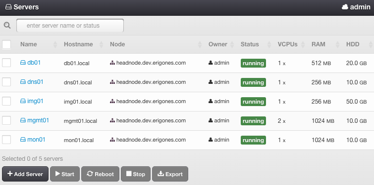

.. _admin_dc:

Admin Virtual Data Center
#########################

.. This section needs more information

Virtual servers in Admin Virtual Data Center are essential for proper functioning of the *Danube Cloud*. It is not recommended to use this virtual data center for any other purposes. 

.. warning:: Manipulating Compute Nodes, virtual servers, or other objects in the Admin Virtual Data Center can break *Danube Cloud*.

.. warning:: The *mgmt01* VM MUST NOT be restarted or shut down during the operation of the *Danube Cloud*.

.. seealso:: More information about :ref:`virtual data centers <datacenters>`.

Virtual Servers in the Admin Data Center
========================================

.. Short description of each component would be useful, for person encoutering the documentation for the first time.
.. Some kind of quick architecture overview would be useful in this case.

* **mgmt01** - central web management server.
* **mon01** - :ref:`main monitoring server <main_monitoring>` running `Zabbix <http://www.zabbix.com>`_.
* **cfgdb01** - configuration database server running `Apache ZooKeeper <https://zookeeper.apache.org/>`_.
* **dns01** - primary DNS server running `PowerDNS <http://www.powerdns.com>`_. 
* **img01** - central image server used for storing virtual server disk images.

.. note:: The **root** accounts in each virtual server have the first compute node's public SSH key set during installation and therefore are accessible from first compute node via SSH.

.. note:: Zabbix is a registered trademark of `Zabbix LLC <http://www.zabbix.com>`_.
