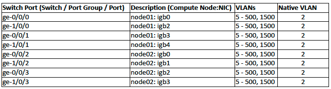

Prerequisites and Pre-installation Tasks
****************************************

.. _cn_image:

Compute Node Installation and Boot Media
########################################

The installation and boot media is a USB flash drive. There are two types of USB images:

======================================    ============   ================
**Image name**                            **USB size**   **Description**
--------------------------------------    ------------   ----------------
``esdc-<edition>-hn-<version>.img.gz``    4 GB           Used for installation of the first compute node.
``esdc-<edition>-cn-<version>.img.gz``    2 GB           Used for installation of any other compute node.
======================================    ============   ================

.. note:: The first compute node image is just a reqular compute node that includes *Danube Cloud* :ref:`service virtual machines <admin_dc>`.

The current version of both media can be downloaded from:

- **Community Edition**: https://danubecloud.org/download
- **Enterprise Edition**: https://danubecloud.com/download (customer credentials are issued by Erigones upon request) 

In the file ``notes-x.y.z.txt``, you can find SHA1 checksums of both images and an automatically generated **root** password needed for recovery purposes and single user mode, respectively.

It is recommended to use two identical USB flash drives simultaneously in case one of them would fail.

.. _usb_key_howto:

Creating a Bootable USB Flash Drive
###################################

.. warning:: Incorrect procedure of creating a USB flash drive can cause data loss!

.. warning:: Before writing anything to the USB flash drive, make sure that it does not contain any important data. The image copying procedure destroys all contents of the USB flash drive.

* Linux

    .. code-block:: bash

        # Unpack the gzip archive:
        gunzip esdc*.img.gz

        # Copy the image file onto the USB flash drive:
        dd bs=1M if=esdc*.img of=/dev/sdX

* Mac OS X

    .. code-block:: bash

        # Determine the device identifier of the USB flash drive:
        diskutil list

        /dev/disk3
        #:  TYPE NAME                    SIZE       IDENTIFIER
        0:  FDisk_partition_scheme       2.0 GB     disk3
        1:  DOS_FAT_32                   2.0 GB     disk3s1

        # Unmount the USB flash drive:
        diskutil unmountDisk /dev/disk3

        # Unpack the gzip archive:
        gunzip esdc*.img.gz

        # Copy the image file onto the USB flash drive:
        # (To achieve faster data transfer, use the device
        # identifier /dev/rdiskX instead of /dev/diskX.)
        sudo dd bs=1m if=esdc*.img of=/dev/rdisk3

* Windows

    #. Unpack the gzip archive ``esdc*.img.gz``. If necessary, install a free and open source application `7-Zip <http://www.7-zip.org/>`_, which is capable of handling archives in gzip format.

    #. Install an open source utility `win32diskimager <https://wiki.ubuntu.com/Win32DiskImager>`_ or `Rufus <https://rufus.akeo.ie/>`_ designed for writing disk images to USB flash drives.

    #. Insert the USB flash drive.

    #. Write the unpacked ``esdc*.img`` image file to the USB flash drive.

.. _factory_reset:

Compute Node Factory Reset
##########################

A reinstall requires the *zones* zpool to be removed from local disks before proceeding. This can be done in one of the following ways:

* Add a boot parameter ``,destroy_zpools=true`` into the Grub boot loader. You can edit boot parameters in Grub menu by selecting an appropriate boot option and pressing ``e`` two times on your keyboard. Confirm your changes by pressing ``Enter`` and ``b``. The compute node will continue to boot up and the *zones* zpool will be destroyed before new clean install.

* Manually formatting the hard drives which are used for the *zones* zpool. This can be done directly through the embedded RAID management of the server which is available when the server boots up.

.. _portmap:

Preparing your Network Infrastructure
#####################################

*Danube Cloud* utilizes a concept of virtual networks. A virtual network is a logically separated subnet that allows virtual machines to connect to the external networks (e.g. internet) or to communicate internally within the *Danube Cloud* data center.

There is one special virtual network called *admin* that is used for internal purposes. During the installation of the first compute node, you will be asked for information about this network. The *admin* network requires access to the internet. It should be a full /24 subnet (256 IP addresses) at least and cannot be smaller than a /26 subnet (64 IP addresses). Also, it cannot be a tagged VLAN connected to the physical node using a trunk port.

Aside from the *admin* network, using of VLAN tags for other virtual networks is recommended as it ensures virtual network separation. You can either use a separate physical interface (:ref:`or interfaces aggregated with LACP<network_aggregation>`) for the *admin* network and the rest of physical interface(s) for other virtual networks, or you can :ref:`aggregate<network_aggregation>` all physical interfaces together, setup a native (untagged) VLAN as a *admin* virtual network and forward all other networks as trunk VLAN to the physical *Danube Cloud* nodes (recommended).

.. seealso:: For more information on how to setup virtual networks and their connection to the physical interfaces please see a :ref:`separate chapter about networking <network_interface>`

If you don't have an appropriate hardware router or firewall, you can create one virtual server inside *Danube Cloud* (e.g. SunOS Zone) with two network interfaces - internal and external - and setup it to serve as a network router for your internal subnets (virtual networks).

Below is an example port map for interconnection of two *Danube Cloud* compute nodes using two stacked switches, VLANs for virtual networks, link aggregations for speed and redundancy and with the *admin* virtual network as a native VLAN.

:download:`Example port map in XLSX format (Excel spreadsheet) <portmap.xlsx>`.

.. _bios:

BIOS Configuration
##################

The following settings should be configured in BIOS configuration of your compute node (if available):

- Enable hardware virtualization (KVM) support.

    .. warning:: Hardware virtualization (KVM) support must enabled at least on the first compute node.

- Enable ACPI SRAT. If ACPI SRAT is not available in your BIOS configuration, disable NUMA/Node interleaving. Otherwise the following message may appear during boot time:

    .. code-block:: text

        WARNING: Couldn't read ACPI SRAT table from BIOS. lgrp support will be limited to one group.

- Disable CPU C-States.

    .. note:: Some Intel® processors, which are using the C-States feature can cause an error that may seriously endanger correct functioning of a compute node. The error is treated in the system, but you are advised to disable C-States in the BIOS configuration.

- Disable USB 3 support.

    .. warning:: Currently, USB version 3 is not supported and must be disabled, otherwise the operating system initialization may fail.

- Enable legacy boot support.

    .. warning:: UEFI boot is not supported at the moment.

.. _ipmi_over_lan:

IPMI over LAN / Serial Redirect
###############################

The compute node can be easily accessed remotely through a serial console. It is necessary to allow ``IPMI over LAN`` and ``Serial Redirection`` in the BIOS configuration.

.. code-block:: bash

    # Log in to the serial console by using the ipmitool command-line utility:
    ipmitool -I lanplus -U <USER> -H <IP> -P<PASSWORD> sol activate

