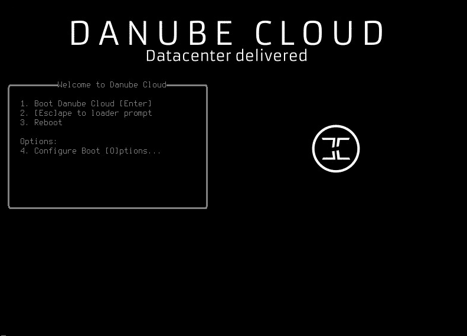
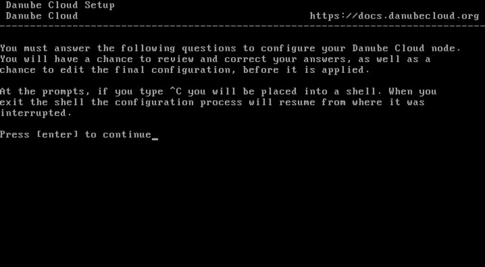
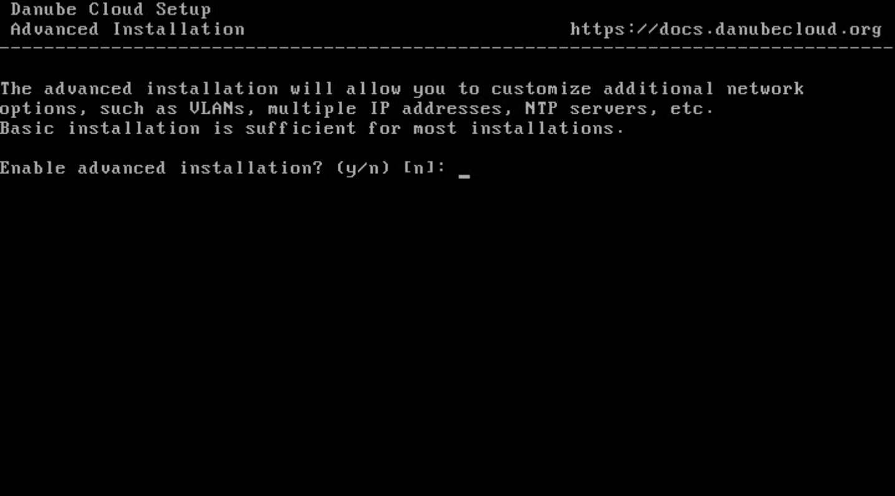
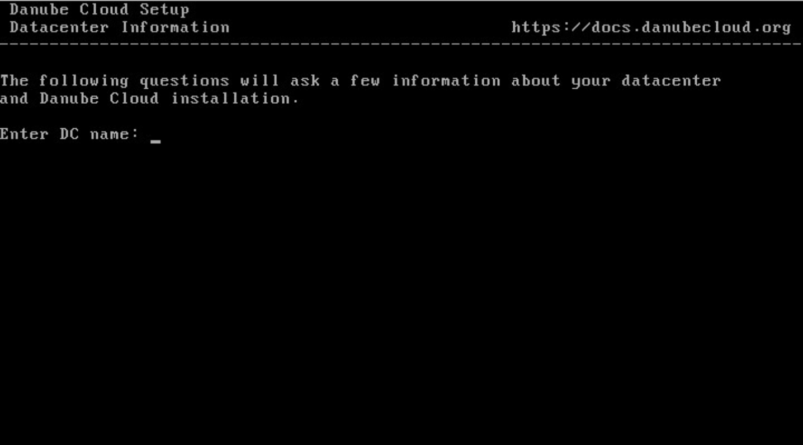
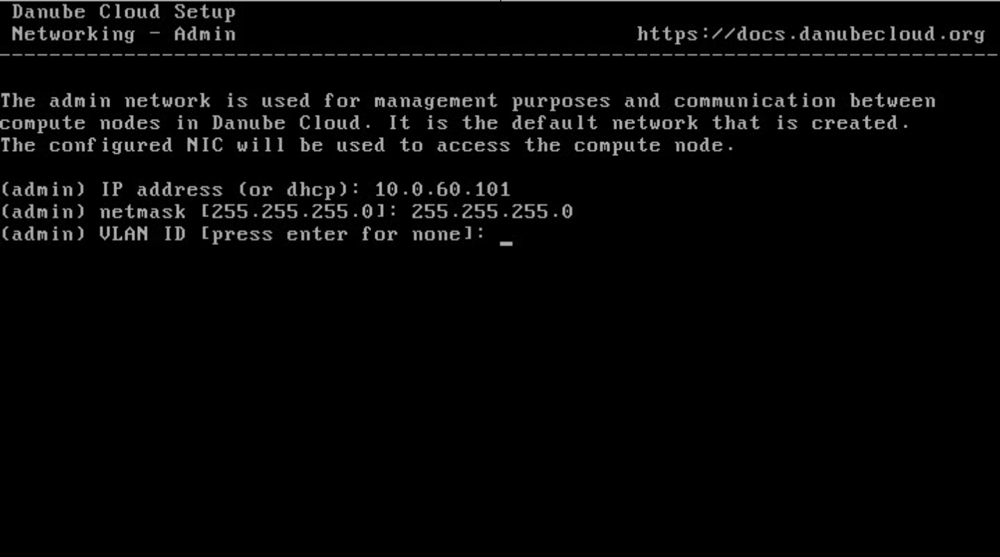
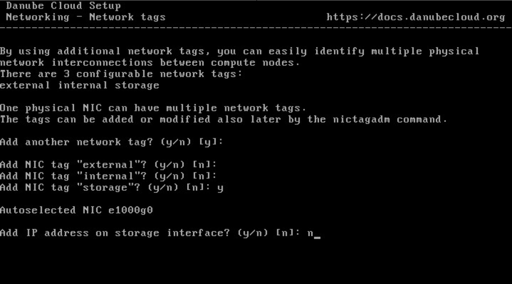
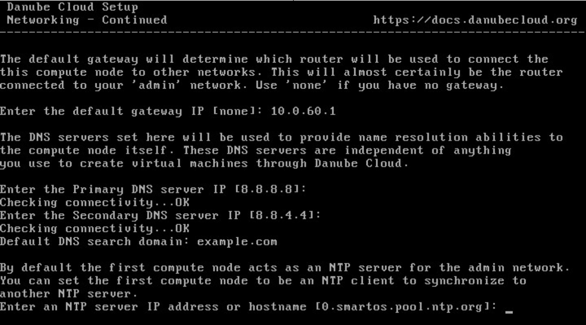
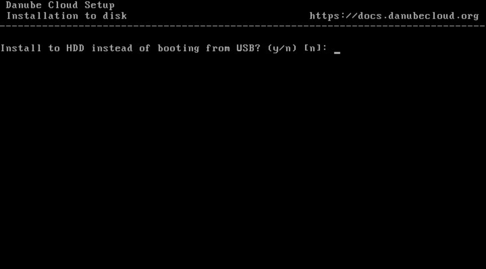
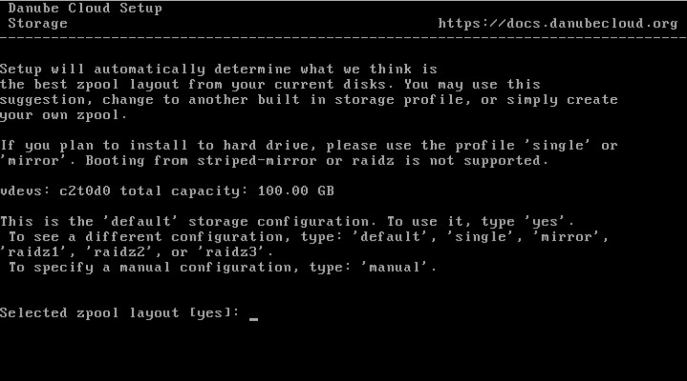
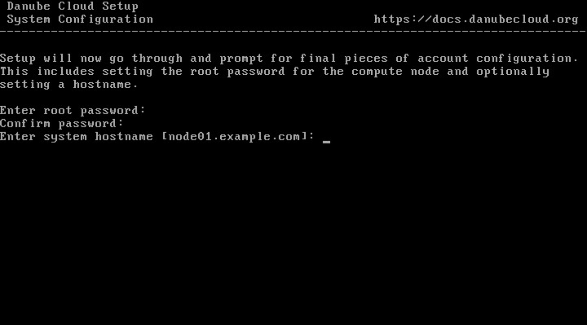

.. _installation_cn:

Compute Node Installation
*************************

.. note:: There are :ref:`two types of installation media<cn_image>` and the installation steps documented below are simillar for both of them. The first compute node installation media should be used only for the first compute node. All other physical servers should be installed using the smaller compute node USB image.

.. _cn_boot_loader:

0. Boot loader
--------------

.. _cn_install_welcome:

1. Welcome screen
-----------------

.. _cn_install_advanced:

2. Advanced installation?
-------------------------

The following settings can be configured only when the **advanced installation** option is enabled:

    - Admin network VLAN ID.
    - IP address on other network tags.
    - Primary and secondary DNS servers.
    - DNS search domain.
    - NTP synchronization host.
    - Remote compute node.

In the **basic installation**, the above options are configured automatically from their default values.

.. _cn_install_datacenter:

3. Physical data center
-----------------------

Setting the name of the physical data center is required on the **first compute node** only.

.. _cn_install_networking:

4. Networking
-------------

.. image:: img/install-03-networking-info.png

The above pictures show:

    * Choosing a network card.
    * Admin network IP address.
    * Admin network mask.
    * Admin network VLAN ID (*advanced installation*, default: ``none``).
    * Configuration of other networks (NIC tags):

        - *external*
        - *internal*
        - *storage*
    * Default gateway IP address.
    * Primary DNS server (*advanced installation*, default: ``8.8.8.8``).
    * Secondary DNS server (*advanced installation*, default: ``8.8.4.4``).
    * DNS search domain (*advanced installation*, default: ``local``).
    * NTP server IP address or hostname (*advanced installation*, default: ``0.smartos.pool.ntp.org``).

.. _cn_install_hdd:

5. Installation to disk?
------------------------

* *Booting from USB (default).* This is the preferred installation method. The hard drives are only used for storing virtual machines and other user data. The hypervisor is loaded into RAM from the USB flash drive. The hypervisor (kernel) can be upgraded by swapping the USB media and rebooting the system. The USB media is required for every boot of the compute node.

* *Installation to hard drive.* This installation type is required when using advanced storage components connected via fiber channel or iSCSI. The contents of the USB flash drive are copied to the hard drives. The USB media should be removed after the installation is finished and before the first reboot.

.. _cn_install_storage:

6. Storage
----------

A primary data storage (the *zones* pool) must be created in this step.

An optimal disk array profile is chosen automatically based on the information gathered about available local disks. The storage can be configured manually, however, this method is only recommended for more experienced users.

.. warning:: Using a SLOG (ZIL) device is not supported when *installing to hard drive*.

.. seealso:: A more detailed explanation of :ref:`disk arrays <storage>` and :ref:`disk redundancy <storage_redundancy>` can be found in a separate chapter.

.. _cn_install_system:

7. System configuration
-----------------------

Choose a compute node's root password and system hostname (fully qualified domain name).

.. warning:: The Compute Node hostname cannot be changed after install.

.. _cn_install_esdc:

8. Danube Cloud services
------------------------

- **First compute node**

    .. image:: img/install-09hn-dc-mgmt.png

    * IP address configuration of the central web management server.
    * Choosing a configuration master password.

- **Any other compute node**

    .. image:: img/install-09cn-dc-mgmt.png

    * IP address configuration of the configuration database server (cfgdb).
    * Entering your configuration master password.

.. _cn_install_operator:

9. Administrator's email address
--------------------------------

    .. image:: img/install-10hn-admin-email.png

Configuring Administrator's email address is required on the **first compute node** only.

.. _cn_install_confirm:

10. Confirmation
----------------

    .. image:: img/install-11-summary.png

Final overview of all information required for setting up the compute node.

Installation process
--------------------

During the installation process of *Danube Cloud*, files are being copied from the USB flash drive to the primary data storage which usually takes about 5 to 20 minutes.

Post-installation tasks
-----------------------

After a successful installation, please log in to the Web Management Server.

- **First compute node**: Login and password to the web management are ``admin`` and ``changeme``. Please change the password as soon as possible using the :guilabel:`Change Password` form in the :ref:`user profile section<user_profile>`.

    .. seealso:: Please have a look at the :ref:`post-installation section in this chapter <first_steps>`.

- **Any other compute node**: The compute node will appear in the web interface of the central web management server automatically.

.. seealso:: How to change the password used for accessing the Compute Node is described in the :ref:`root password change <root_password_change>` section.
