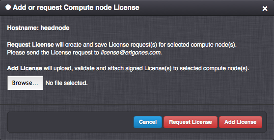

.. _node_license:

Compute Node Licenses
*********************

.. note:: This section describes functionality available only in the *Danube Cloud Enterprise Edition*.

.. note:: *Danube Cloud* products can be used only with valid license keys.

The Compute Node License, or Activation Key (AK) is a time-limited certificate. Valid certificate is required so that full functionality of the Compute Node is available within the *Danube Cloud* system. For each Compute Node a Compute Node License must be requested via the *Danube Cloud* user interface (:ref:`API <API>` or :ref:`GUI <GUI>`). A license request can be made only after the Compute Node was installed and registered in the *Danube Cloud* system. The license request (Certificate Signing Request) can be created and saved into a file after pressing the ``Request License`` button in the Compute Node's details section. The license request file (CSR) should be sent via email to the email address specified in the License Agreement (``license@erigones.com``).

After receiving a Compute Node License request, Erigones will issue a valid Compute Node License (Certificate) for the required Compute Node and for a limited period of time. Erigones will send a file with the Compute Node License via email to the customer's email address stated in the License Agreement. The Compute Node License (Certificate) file needs to be uploaded and attached to a specific Compute Node via the *Danube Cloud* user interface (:ref:`API <API>` or :ref:`GUI <GUI>`) by selecting the ``Add License`` button. After successful verification of the License Key, the compute node is activated, and it is possible to create and manage virtual servers on the Compute Node. The current state and remaining time period of the Compute Node License be viewed through the *Danube Cloud* user interface in the Compute Node details section.

.. warning:: Working with virtual servers is possible only on a Compute Node with a valid Compute Node License.

.. note:: You are advised to request the Compute Node License renewal before the expiration of the currently valid license.

